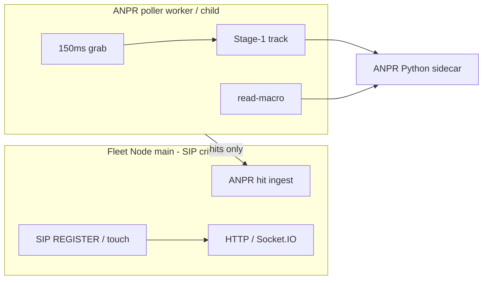

# MOB DISC — Concurrent modules for ship (Fleet + ANPR + … same time)

**Date:** 2026-08-11  
**Status:** DISC — product architecture for **selling** Mobility Axiom, not a lab shrug  
**Operator stance:** All planned modules must run **online together**. Grab stays aggressive. “Slow ANPR so SIP lives” is **not** an ending.

---

## Plain English

If we ship like this — Fleet presence and ANPR heavy work fighting inside **one Node event loop** — customers with Live ANPR + Ops + video will see **Online/Offline flap** while plates still work. That is **not** sellable as “enterprise concurrency.”

We already planned modules to run at once. The bug is **process placement**, not “ANPR is too ambitious.”

| Layer | Role | Today |
|-------|------|--------|
| Fleet Node (`server.js`) | SIP REGISTER, presence, roster, sockets, video handoff | **Also** ANPR grab/track/harvest on same loop |
| ANPR sidecar (Python) | Stage‑1 / CCPD / OCR | Separate process — fine |
| Dashboard | UI | Fine |

**Sidecar isolation is already correct.**  
**Node poller on the SIP process is the lousy part.**

---

## Locked facts (do not “end” by cutting product)

1. **Grab cadence stays** (~150ms) — no less grab.  
2. **Multi-target stays.**  
3. **All modules online together** = ship requirement, not optional.  
4. Do **not** raise `DEVICE_OFFLINE_MS` to hide starve.  
5. Do **not** park WVP / gut Fleet / turn ANPR off.  
6. Temporary yield/async I/O is a **bridge**, not the product story.

---

## What “good ending” looks like (sell path)

**ANPR live poller leaves the SIP-critical main thread.**

- Main Node: SIP, presence, sockets, WVP handoff, APIs — stays responsive.  
- ANPR worker/child: 150ms grab → track → harvest → OCR HTTP → posts hits back to main via message / localhost queue.  
- Python sidecar unchanged.  
- Same UI, same rail, same license gates.

That is how modules stay online **at the same time** without presence flap.

---

## APPLY ladder (one at a time — finish, don’t park)

### 1) Bridge (same day, keep grab) — optional if flap is burning lab now

`MOB-APPLY ANPR-PRESENCE-YIELD-KEEP-GRAB-V1`  
Async file I/O + event-loop yield + OCR in-flight cap. **Does not** cut grab. **Does not** claim ship architecture done.

### 2) Ship architecture (the real ending) — **recommended next for product**

`MOB-APPLY ANPR-POLLER-ISOLATE-WORKER-V1`

**Scope:**

- Move live producer/consumer/harvest out of main `server.js` event loop into **`worker_threads` or child `node lib/anprLivePollerWorker.js`**.  
- Main process: start/stop watch slots, receive published ticks, existing APIs.  
- Keep `GRAB_MS=150`, multi-target, sidecar contracts.  
- No Firmware Gold / SIP core rewrite; no OCR model change.

**PASS (customer-shaped):**

1. Ops + Live ANPR + (normal) video watch **together ≥10 min**.  
2. Roster **stable Online** (no keepalive flap).  
3. ANPR multi-lane plates still flow.  
4. CPU may be high — **presence must not die**.

**FAIL → next named only:** `ANPR-POLLER-CHILD-PROCESS-V1` (full OS process) if worker_threads still shares enough pain — still no grab cut.

---

## Explicitly rejected endings

- Sell with “turn ANPR down when Fleet busy”  
- Sell with “presence timeout 5 minutes so it looks online”  
- Sell with modules that cannot run concurrent  
- End the disc on “less grab”

---

## Recommendation (one line)

**Next product APPLY:** `MOB-APPLY ANPR-POLLER-ISOLATE-WORKER-V1`  
Bridge yield only if you need lab calm **before** the isolate MOB — not instead of it.

Related earlier note: `MOB-DISC-FLEET-PRESENCE-FLAP-ANPR-LOAD-20260811.md` (same topic; grab lock + yield detail). This disc owns the **sell / concurrent-modules** ending.
