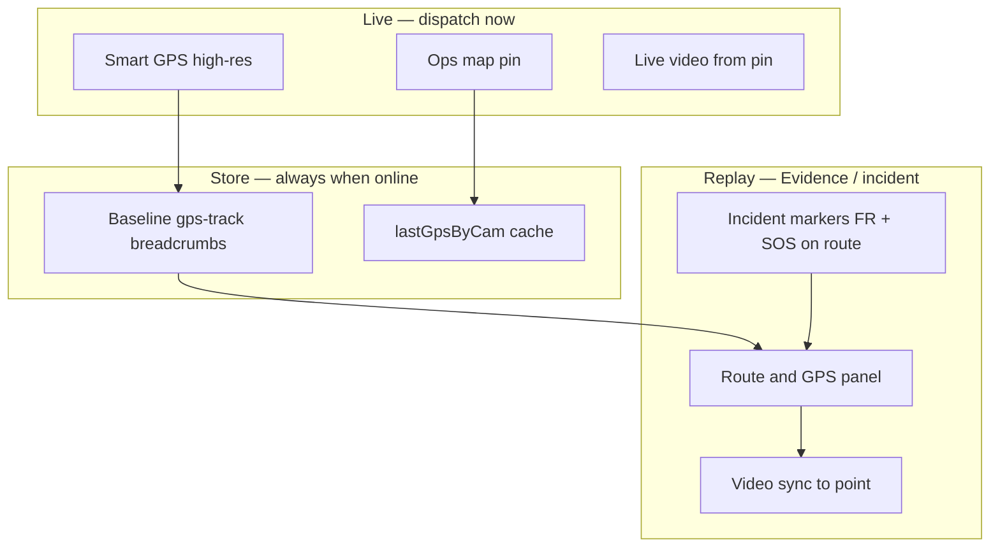

# MOB DISC — BWC route trace unified · FR + SOS + HQ track · industry parity

**Status:** DISC only — **2026-07-11**  
**Trigger:** Operator — same as Evidence route tracing; officers online recorded; HQ can track; tie FR/SOS/alerts together; how competition does officer tracking  
**Search:** route trace, smart gps, gps-track, fleet track button, officer location, incident trace, Axon Respond, VMS map  
**Related:** `MOB-DISC-FR-BWC-GPS-TRACE-INCIDENT-ACCOUNTABILITY.md`, `MOB-DISC-FR-MAP-BUTTON-GO-OPS-PIN.md`, `MOB-DISC-FR-LIVE-POLL.md`, `MOB-DISC-SOS-LEDGER-GOVERNANCE.md`

---

## Verdict — yes, we already have the spine

**You are correct:** FR hit GPS, SOS map focus, and Evidence **Route & GPS** are the **same product family** — **unit route tracing** for dispatch and after-action review.

ME8 **already ships** most of the plumbing. What is missing is **one operator story** and **wiring incidents → high-res trace → route replay**.

---

## What we have today (code truth)

### A — Baseline breadcrumbs (all online BWCs)

| Piece | Behaviour |
|-------|-----------|
| `lastGpsByCam` | Latest position cache (`storage/last-gps.json`) — map pin, FR `getGps()` |
| `gpsTrack.recordPoint()` | Append-only route store in **site DB** on every valid SIP GPS |
| `FM_GPS_POLL_MS` | Default **120s** patrol poll via SIP MobilePosition |
| Settings | `/api/gps-track/settings` — interval, min move metres, retention days |
| Query | `/api/gps-track/route?deviceId&from&to` |

**When recorded:** Whenever the BWC reports GPS over SIP (online), points append subject to move/time filters — **not only when user clicks Track**.

### B — Smart GPS (high-resolution incident / manual track)

| Piece | Behaviour |
|-------|-----------|
| `lib/smartGpsTrack.js` | SIP **Interval** query — default **15s** (`FM_GPS_HIGH_RES_INTERVAL_SEC`) |
| **Manual** | HQ **Settings → Fleet** row **📍** → `POST /api/smart-gps/track` reason `manual` |
| **SOS alarm** | Auto-start on `sos-alarm` for alarming BWC (`onSosAlarmPushed`) |
| **SOS team** | `POST /api/smart-gps/sos-team` — nearby helpers reason `sos-team` |
| UI | Fleet row status **GPS track** (cyan); `smart-gps-state` socket sync |
| Store | High-res devices get denser `recordPoint` interval (~12s cap in `gpsTrack.js`) |

**This is the “HQ click to track them” feature — it exists.**

### C — Evidence Route & GPS (after-action replay)

| Piece | Behaviour |
|-------|-----------|
| `public/js/route-trace.js` | Leaflet polyline + point list + scrubber |
| Load | `/api/gps-track/route` for date/time window |
| Video sync | Evidence file near point (`/api/gps-track/evidence-at`) — Axon-style replay |
| Panel | Evidence hub → **Route & GPS** |

**This is the “route tracing like Evidence” you built — forensic shift review.**

### D — Live Ops map

| Piece | Behaviour |
|-------|-----------|
| Ops map pins | `upsertDeviceMarker`, pin popup → live video |
| SOS | Pan + circle + nearby + auto smart GPS on alarm BWC |
| FR hit | **Gap** — no GPS on hit payload; Map button dead (`MOB-DISC-FR-MAP-BUTTON-GO-OPS-PIN.md`) |

---

## Unified model (locked)



| Mode | Operator question | ME8 surface |
|------|-------------------|-------------|
| **Patrol** | Where are my units? | Ops map + fleet list (last GPS) |
| **Manual track** | Follow this officer closely | Fleet **📍** → smart GPS |
| **Incident** | SOS / FR hit — dense trail + map | Smart GPS auto + moment marker |
| **After-action** | What route + what video at 21:40? | Evidence **Route & GPS** |
| **Accountability** | What did dispatch see/do? | Audit + ledger + route export |

**One stack — three speeds:** patrol (120s) · incident (15s) · replay (stored points).

---

## How enterprise competition does it (public patterns)

Patterns from major public-safety platforms (product docs — not OEM names in ship copy):

| Pattern | Typical behaviour | Ubitron ME8 fit |
|---------|-------------------|-----------------|
| **Live map markers** | Officer/unit on georeferenced map; hover = last update time | **Have** — Ops map + fleet |
| **Marker → live video** | Click unit → side panel with location + live stream | **Have** — pin popup |
| **Location cadence** | ~10s when recording/moving; slower idle; agency toggle | **Partial** — 120s patrol; 15s smart GPS on incident/manual |
| **High-priority alert on map** | Red ring / banner; jump map to source | **SOS yes** · **FR partial** (toast, no circle yet) |
| **Dispatch-initiated track** | Supervisor enables closer follow | **Have** — fleet 📍 manual smart GPS |
| **Incident-auto track** | Alarm raises location rate for source unit | **SOS yes** · **FR no** |
| **Recording ↔ GPS** | Denser updates while recording (policy) | **Telemetry `recording` exists** — not wired to smart GPS yet |
| **Route + evidence replay** | Scrub route; open video at timestamp | **Have** — `route-trace.js` |
| **Audit** | Who opened live map / stream | **Partial** — smart GPS start/stop audited; stream audit later |
| **RTCC single pane** | Alerts + ALPR + video + units one map | **Direction** — Ops + FR + SOS converge (Fusus-class) |

**Ubitron honest position:** Evidence route replay + SOS smart GPS are **ahead of FR wiring**. FR should **plug into the same rail**, not a second map religion.

---

## Recording vs online — policy (locked direction)

| State | GPS behaviour (target) |
|-------|------------------------|
| **Online, idle** | Baseline poll (`FM_GPS_POLL_MS`) + breadcrumbs |
| **Online, recording** | Optional **denser baseline** (site policy) — use fleet `recording: '1'` telemetry |
| **Manual HQ track** | Smart GPS `manual` until operator stops |
| **SOS alarm** | Smart GPS `sos-alarm` on source BWC + optional `sos-team` helpers |
| **FR watchlist hit** | Smart GPS `fr-hit` on catching BWC (**new reason**) + GPS on hit payload |
| **Offline** | Last known pin TTL on map only; route store keeps history |

**Do not** track 24/7 at 15s for whole fleet — incident-driven + manual only (cost + privacy).

---

## Tie FR + SOS + alerts together

| Event | GPS on alert | Smart GPS | Map | Route replay |
|-------|--------------|-----------|-----|--------------|
| **SOS** | Yes (payload) | Auto `sos-alarm` | Circle + nearby | Open route ±window |
| **FR hit** | **MOB #1** | **MOB #2** `fr-hit` | **MOB #3** focus pin | **MOB #4** deep-link Route trace |
| **Standby PTT team** | — | `sos-team` pattern for FR helpers | Map summary | Audit |
| **Manual fleet track** | — | `manual` | Pin follows | Operator-chosen window |

### Incident moment on route (visual)

When replaying a shift in Evidence Route & GPS:

- **Polyline** = unit path (existing)
- **Diamond marker** = FR hit at `lat/lon` + time
- **Red marker** = SOS at time
- Click marker → crop / SOS detail / video at point

Same data: `gps-track` points + `fr-snap-ledger` + SOS ledger timestamps.

---

## MOB plan (route trace genre)

| # | MOB | Delivers |
|---|-----|----------|
| **1** | **`mob-fr-hit-gps-on-emit`** | Hit payload + audit lat/lon |
| **2** | **`mob-fr-hit-smart-gps`** | `smartGpsTrack.start(camId, 'fr-hit')` on blacklist hit; stop on ack/dismiss policy |
| **3** | **`mob-fr-map-focus-pin`** | Ops + pin popup (dispatch now) |
| **4** | **`mob-fr-hit-route-deep-link`** | Drawer/toast **“Route trace”** → Evidence Route panel pre-filled cam + ±30 min |
| **5** | **`mob-incident-route-markers`** | FR + SOS icons on `route-trace.js` map for window |
| **6** | **`mob-gps-recording-density`** | When `recording==='1'`, optional tighter baseline (site setting) |
| **7** | **`mob-fr-standby-smart-gps`** | Standby PTT team → `fr-team` batch (mirror `sos-team`) |

**Order:** **1 → 2 → 3** (live dispatch) · **4 → 5** (replay) · **6–7** polish.

One MOB at a time.

---

## PASS checkpoint — unified trace (after 1–4)

1. BWC online on map with baseline breadcrumbs in DB.
2. **Manual:** Fleet 📍 → status GPS track → denser points in `/api/gps-track/route`.
3. **SOS:** Alarm → smart GPS on source BWC (existing).
4. **FR hit:** Toast shows GPS · Map works · smart GPS `fr-hit` active on catching unit.
5. **Replay:** From FR drawer → Route trace opens with correct cam + time window; polyline visible.
6. Ack FR hit → smart GPS stops per policy.

---

## Apply commands

```
MOB-APPLY mob-fr-hit-gps-on-emit
MOB-APPLY mob-fr-hit-smart-gps
MOB-APPLY mob-fr-map-focus-pin
```

Later:

```
MOB-APPLY mob-fr-hit-route-deep-link
```

---

## FAQ

| Question | Answer |
|----------|--------|
| Do we already have route tracing? | **Yes** — `gpsTrack` + Evidence **Route & GPS**. |
| HQ track button? | **Yes** — Fleet 📍 manual; **no cap today** · see `MOB-DISC-SMART-GPS-MANUAL-TRACK-LIMITS.md` |
| Recorded only when online? | Breadcrumbs append when GPS arrives; **high-res** is manual or incident. |
| Same as FR person track? | **No** — person track = same *face* across units; this DISC = one *BWC unit* path. Both use GPS store. |
| Competition? | Live map + alert jump + denser GPS on incident + route/evidence replay + audit. We align, not fork. |
| Legal / officer support? | After-action route + what was streamed + audit — supports lawful review under site policy. |

---

## Cross-links

| Doc | Topic |
|-----|--------|
| `MOB-DISC-FR-BWC-GPS-TRACE-INCIDENT-ACCOUNTABILITY.md` | Moment stamp + accountability |
| `MOB-DISC-FR-MAP-BUTTON-GO-OPS-PIN.md` | Map button fix |
| `MOB-DISC-FR-LIVE-POLL.md` | Person track across BWCs |
| `MOB-DISC-FR-HALF-FACE-SNAP-LEDGER.md` | Snap ledger forensic store |
