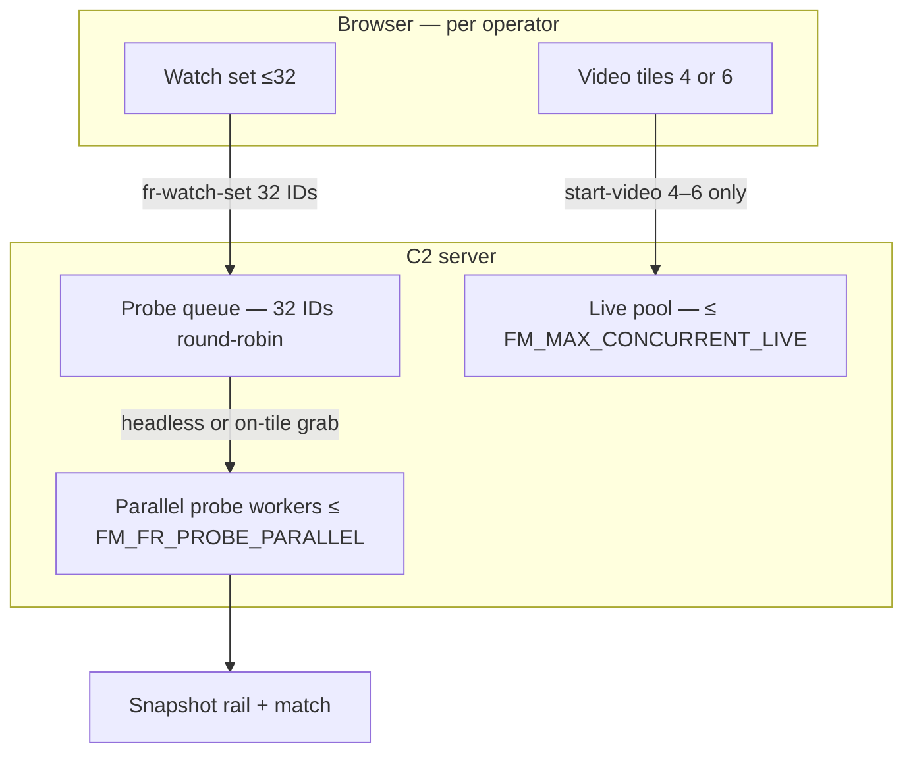

# MOB DISC — FR 32 watch set · 4 (or 6) video · probe queue truth

**Status:** DISC 2026-07-11 — **no APPLY**  
**Trigger:** Original justification = **32 BWCs** in watch, **4 video tiles**, rest still snap via rotation. Now sounds like “only 4 site-wide”? **Design did not shrink — implementation gap + wording.**  
**Search:** 32 watch, 4 probe, rotate snap, off-tile, probe queue, LIVE_SLOTS  
**Related:** `MOB-DISC-FR-LIVE-POLL.md`, `MOB-DISC-FR-6TILE-MULTI-ADMIN.md`, `MOB-DISC-FR-BWC-CAPTURE-ENGINE-ORDER.md`

---

## What you were sold (still locked — unchanged)

| Layer | Count | Meaning |
|-------|-------|---------|
| **Watch set** | **32** | Operator selects up to 32 online BWCs to monitor this shift |
| **Video tiles** | **4** (or **6** per 6-tile DISC) | Only this many **decoded on screen** at once (save bandwidth + CPU) |
| **Face snap + match** | **All 32 in watch** | Every selected BWC gets **periodic** still grab + detect + 1:N — **not only the 4 on screen** |

**Operator story (correct):**

> “I pick 32 officers. I **see** 4 (or 6) at a time. The system **keeps scanning the whole watch set** — the ones not on screen **still produce snapshots** on the rail as rotation / background probe reaches them.”

That is what the **justification deck** described. It did **not** mean 32 simultaneous video walls.

---

## What the code does today (honest gap)

Two different limits were **collapsed into one number (`4`)** in implementation:

```
┌─────────────────────────────────────────────────────────────┐
│  DESIGN (32 watch / 4 video / 32 probe over time)         │
├─────────────────────────────────────────────────────────────┤
│  VIDEO_SLOTS = 4     → tiles + browser decode             │
│  PROBE_QUEUE = 32    → round-robin still grab + embed      │
└─────────────────────────────────────────────────────────────┘
                          ↓ implementation merged ↓
┌─────────────────────────────────────────────────────────────┐
│  TODAY: FM_FR_LIVE_SLOTS = 4 caps BOTH                      │
│  • fr-live-watch: only 4 streams at a time (rotate) ✓     │
│  • frLivePoller: only 4 cams probed per tick ✗            │
│  • grabJpeg: requires pool stream ✗ (no stream = no snap)   │
│  • fr-watch-slots: sends only activeSlotCams() (4) ✗      │
└─────────────────────────────────────────────────────────────┘
```

### Code pointers

| File | Behaviour |
|------|-----------|
| `fr-live-watch.js` `emitWatchSlots` | Sends **`activeSlotCams()` only (4)** — not full 32 `selected[]` |
| `frLivePoller.js` `collectProbeCams()` | Union sockets + `analytics-fr` viewers → **`slice(0, LIVE_SLOTS)`** → **max 4** |
| `frLiveProbe.js` `grabJpeg` | **`isStreamingForCam`** required — off-tile cams **cannot** snap |
| `fr-live-watch.js` rotate | Swaps **video** every 20s — probe only while cam is **on a tile** |

### So what actually happens?

| Model | Reality today |
|-------|---------------|
| **32 snap continuously** (background queue) | **No** — only cams with **active live stream** snap |
| **32 snap via rotation** (each gets turn on tile) | **Partial** — when cam is on tile ~20s+ it can snap; off-tile **silent** |
| **Multi-admin 32+32** | **Worse** — union still capped at **4** probed |

**Nothing in the product spec changed from 32 → 4.** The **probe queue was never fully built** — only the **video rotate** was.

---

## Why “only 4 probed” appeared in multi-admin DISC

That statement was about **simultaneous** server face work **per tick**, not the **watch set size**.

| Term | Meaning |
|------|---------|
| **Watch set** | 32 cam IDs selected |
| **Video slots** | 4 (or 6) decoded now |
| **Probe slots** (today) | **4** — wrongly tied to video |
| **Probe slots** (target) | **4–8 parallel** grabs, **32** round-robin queue |

We must **split** `VIDEO_SLOTS` and `PROBE_QUEUE` in config and code.

---

## Target architecture — restore 32 (enterprise)



### Locked rules

| Rule | Value |
|------|--------|
| `FM_FR_WATCH_MAX` | **32** (unchanged) |
| `FM_FR_VIDEO_SLOTS` | **4** default · **6** recommended (6-tile DISC) |
| `FM_FR_PROBE_PARALLEL` | **4–8** — how many cams get **still+embed per 2s tick** |
| `FM_FR_PROBE_MODE` | `queue` (target) · `tile-only` (today legacy) |

### Two probe modes (pick at APPLY)

| Mode | Video | Off-tile snap | Pool use |
|------|-------|---------------|----------|
| **A — Tile-only** (today) | 4–6 | Only when rotated onto tile | Low |
| **B — Headless queue** (target) | 4–6 | **Yes** — server rotates **short invite** or pool tap for grab **without** browser tile | Medium |
| **C — Hybrid** | 4–6 | On-tile: full stream; off-tile: **5s headless burst** every N minutes | Balanced |

**Recommendation:** **Mode C (hybrid)** for walking BWC — matches “non-view still snap” without 32 full-time decodes.

---

## How to increase probe capacity (MOB plan)

### Step 1 — Send full watch set to server

**MOB:** `mob-fr-watch-set-server-sync`

| Change | Detail |
|--------|--------|
| `fr-watch-slots` payload | Add `watchSet: selected[32]` always when watching |
| `setWatchSlots` | Store full queue per socket.id |
| Threshold | Per socket (unchanged) |

### Step 2 — Split video cap vs probe cap

**MOB:** `mob-fr-probe-queue-32`

| Env | Default | Meaning |
|-----|---------|---------|
| `FM_FR_VIDEO_SLOTS` | 4 or 6 | Tiles + `start-video` count |
| `FM_FR_PROBE_PARALLEL` | **6** | Cams probed per poller tick |
| `FM_FR_PROBE_QUEUE_MAX` | **32** | Round-robin queue depth per session |
| Remove conflation | `FM_FR_LIVE_SLOTS` → split into VIDEO + PROBE |

`collectProbeCams()` becomes:

1. Build queue from **all** `watchSet` IDs (per socket union for multi-admin)  
2. Round-robin pointer — advance each tick  
3. Take next `PROBE_PARALLEL` cams that are **online**  
4. **Not** `slice(0, 4)` of whoever is on video only  

### Step 3 — Off-tile grab (headless)

**MOB:** `mob-fr-headless-probe-grab`

| Option | Detail |
|--------|--------|
| **Light** | While cam on tile, stream exists — grab works (Mode A fix + queue scheduling) |
| **Full** | For off-tile queue entry: `liveStreamPool.ensureHeadlessProbe(camId, 8s)` — invite, one jpeg, release if no tile refs |

Requires respecting `FM_MAX_CONCURRENT_LIVE` — headless counts as pool session **briefly**.

**Fairness:** max **N** headless invites in flight (e.g. 2) so video tiles always win.

### Step 4 — Multi-admin union

**MOB:** `mob-fr-multi-admin-poll-union`

| Rule | Detail |
|------|--------|
| Distinct cams across admins | Union for **pool** budget |
| Per-admin queue | Each socket keeps own 32 queue |
| Site probe budget | `FM_FR_SITE_PROBE_PARALLEL` = 8 — fair share across sockets |

### Step 5 — Speed (already DISC’d)

Without `mob-fr-capture-grab-tune` + primary engine, probing 6–8 per tick **backs up**. Engine genre is **not optional** for true 32.

---

## Timing — will 32 actually cycle fast enough?

**Rough math** (after fix, `PROBE_PARALLEL=6`, `POLL_SEC=2`):

| | |
|--|--|
| Cams probed per tick | 6 |
| Ticks per minute | ~30 |
| Probes per minute | ~180 cam-ticks |
| Full 32 queue pass | **~11 seconds** wall time per full round-robin cycle (ideal) |

Reality: each probe = grab + embed — at **50ms embed** + **200ms grab**, 6 serial ≈ 1.5s/tick → **32 cams in ~11s** still plausible.

At **DeepFace today**, 6 × 3s = **18s/tick** → 32 cams in **~2 minutes** — acceptable for lab, not ops.

**Video rotate (20s)** and **probe queue** become **independent** — non-view cams snap **without** waiting for tile.

---

## What did NOT change vs justification

| Justification slide | Still true? |
|---------------------|-------------|
| 32 BWCs in one watch | **Yes** — client `MAX_WATCH=32` |
| 4 visible live | **Yes** — video slots |
| Rest continue scanning | **Intent yes** — **code not finished** |
| 8 live fleet SOP | **Yes** — video 4–6 + headless budget ≤ 8 |
| Rotate 20s | **Video** rotate; **probe** gets own queue timer |

---

## Phased APPLY (one MOB at a time)

| Order | MOB | Restores |
|-------|-----|----------|
| 1 | `mob-fr-watch-set-server-sync` | Server knows **32** IDs |
| 2 | `mob-fr-probe-queue-32` | Split VIDEO vs PROBE; round-robin 32 |
| 3 | `mob-fr-headless-probe-grab` | Off-tile snap |
| 4 | `mob-fr-multi-admin-poll-union` | 2–3 admins fair share |
| 5 | `mob-fr-capture-grab-tune` + primary engine | Speed to sustain 6–8 parallel |

**Do not** change watch max to 4. **Do** increase **probe parallelism** and **queue depth**.

---

## Operator FAQ

| Question | Answer |
|----------|--------|
| Did we drop 32 to 4? | **No.** 4 is **simultaneous video + (today) simultaneous probe** — implementation shortcut. |
| Should off-screen BWCs snap? | **Yes** — per original design; needs **probe queue + headless grab** MOBs. |
| How do we increase? | Split `VIDEO_SLOTS` / `PROBE_PARALLEL` / `PROBE_QUEUE=32`; sync full watch set; headless grab. |
| Is 32 still justified? | **Yes** — with **6–8 parallel probes** and fast engine, full queue cycles in **seconds–minutes**, not “4 forever”. |

---

## Bottom line

The **32 BWC watch design is still correct.** What failed is **shipping video rotate without the 32-position probe queue.** “Only 4 probed” describes **today’s bug/shortcut**, not the product ceiling.

**Next MOB to restore intent:** `MOB-APPLY mob-fr-watch-set-server-sync` then `MOB-APPLY mob-fr-probe-queue-32`.
