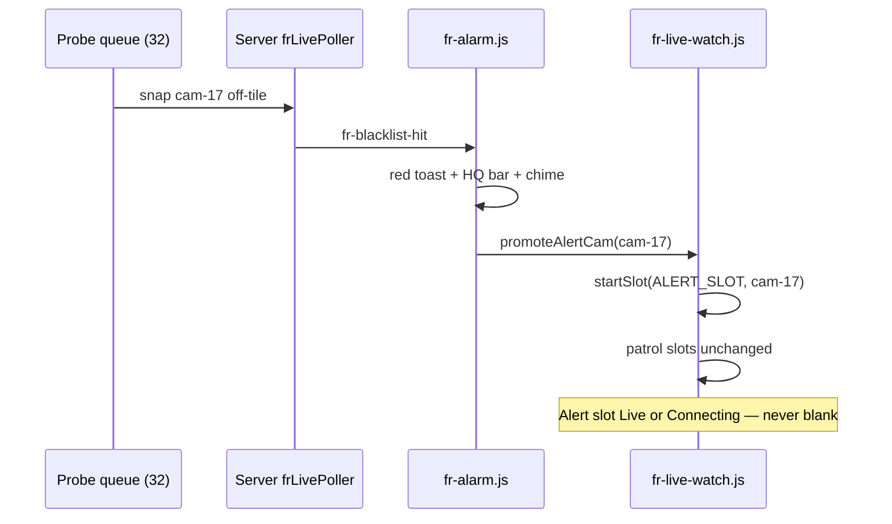

# MOB DISC — FR 6-tile + off-tile blacklist alert · SOP & layout

**Status:** DISC 2026-07-11 — **no APPLY**  
**Trigger:** (1) Move **4 → 6** video — still OK with **32 / all snap**? (2) Hit from BWC **snapping but not on video** — **force** red alert; optional **5 patrol + 1 alert box** (no blank slot)  
**Search:** off-tile hit, alert slot, red toast, 5+1 layout, 6 tile, blacklist popup  
**Related:** `MOB-DISC-FR-32-PROBE-QUEUE.md`, `MOB-DISC-FR-6TILE-MULTI-ADMIN.md`, `MOB-DISC-FR-ALERT-UX-SOP-INDUSTRY-SOS-PARITY.md`

---

## 1) Is **32 / 6 video / all snap** still right?

**Yes.** Only the **visible decode count** changes (4 → **6**). Nothing else in the contract moves.

| Layer | 4-tile era | **6-tile (locked)** |
|-------|------------|---------------------|
| Watch set | 32 | **32** |
| Video decode (browser) | 4 | **6** |
| Probe queue (all snap) | 32 round-robin (target MOB) | **32** (unchanged) |
| `FM_MAX_CONCURRENT_LIVE=8` | 4 FR + headroom | **6 FR + 2** for SOS/map |
| Full video cycle (32, set rotate) | — | **6 sets × ~20s ≈ 120s** |

**6 is OK** and **recommended** over 4 (better BWC pixel fit) and over 8 (keeps 2 live slots).  
Requires same probe-queue MOBs (`mob-fr-probe-queue-32`) — video count does **not** replace background snap.

---

## 2) Problem today — off-tile hit is invisible on the grid

| Step | What happens now |
|------|------------------|
| BWC #17 in watch set, **not** on a video tile | Headless / queue snap → **match** ✓ |
| `fr-blacklist-hit` | Modal + HQ bar + chime ✓ |
| `FrLiveWatch.flashCam(camId)` | **No-op** — cam not on any tile ✗ |
| Operator on Analytics | Hears beep, sees modal — **no live box** for that officer ✗ |

**Gap:** Alert is **audio + modal**, not **forced visibility** on the tile grid for the hitting BWC.

---

## 3) Enterprise SOP — off-tile blacklist alert (locked)

### Principle

> **Every watch-list hit must surface which BWC triggered it within 2 seconds — on video or not.**

### Operator story (SOP steps)

| Step | System | Operator |
|------|--------|----------|
| **1 Detect** | Any of 32 in watch (on-tile or queue snap) ≥ threshold | — |
| **2 Notify** | Chime + **red toast** (non-blocking) + HQ strip + snapshot rail match card | Glance toast: **who / which BWC / %** |
| **3 Show live** | **Auto-promote** hit cam to **Alert channel** (see layout) within 3s | Sees live face on grid even if cam was off-tile |
| **4 Investigate** | Optional detail panel (crop vs watchlist photo) — **must not block** map/roster | Open detail if needed |
| **5 Act** | Ack · Dismiss · Field alert · Standby PTT · Show on map | Per site runbook |
| **6 Restore** | After Ack/Dismiss or **30s** timeout, alert slot returns to standby; patrol rotate continues | — |

### Alert priority (locked)

```
Hit cam > Pinned patrol tile > Normal rotate
```

- Hit cam **preempts** one unpinned patrol slot **or** fills dedicated **Alert slot**.  
- **Never** steal a pinned tile without operator confirm (toast: “Pin blocked alert — tap to override”).

### Red toast (forced, non-modal)

| Field | Content |
|-------|---------|
| Style | Red border, persistent until Ack or 60s auto-minimize to HQ bar |
| Title | **Face match** |
| Line 1 | `{displayName}` · **{score}%** |
| Line 2 | **BWC {deviceLabel}** · {camId short} |
| Thumb | Match crop JPEG |
| Actions | **Show live** (if not yet promoted) · **Open detail** · **Ack** · **Dismiss** |

**Toast is not optional** — fires even when modal suppressed (future “investigate mode”).

### Multi-hit queue

| Rule | Behaviour |
|------|-----------|
| Second hit while first active | Toast stacks; HQ bar shows **+N pending** |
| Alert slot | Shows **highest score** or **most recent** (site flag) |
| All hits | Listed in rail + alert history tab |

---

## 4) Layout options — 6 equal vs **5 + 1 Alert**

### Option A — **6 equal patrol tiles** (simpler code)

```
┌────┬────┬────┐
│ 1  │ 2  │ 3  │
├────┼────┼────┤
│ 4  │ 5  │ 6  │
└────┴────┴────┘
```

On hit: **steal** lowest-priority unpinned slot → show hit cam + red pulse border (`is-fr-hit`).

| Pros | Cons |
|------|------|
| No “special” empty box | Operator may not know **which** slot is alert vs patrol |
| 6 full patrol capacity | Hit disrupts rotate mid-set |

### Option B — **5 patrol + 1 Alert channel** (recommended)

```
┌────┬────┬────┐
│ P1 │ P2 │ P3 │   P = patrol (rotate 5 of watch set)
├────┼────┼────┤
│ P4 │ P5 │ AL │   AL = Alert (dedicated)
└────┴────┴────┘
```

**Alert slot `AL` — never looks broken:**

| State | What operator sees |
|-------|-------------------|
| **Idle** | Dark panel + shield icon + label **“Alert channel”** + subtle pulse ring (not blank “Waiting”) |
| **Connecting** | Spinner + **“Connecting — {BWC name}…”** |
| **Live hit** | Full JSMpeg + red border + label **“MATCH — {name}”** |
| **Hold after Ack** | Last frame thumbnail 5s → fade to Idle |

**Patrol slots 1–5:** normal 32-watch rotate (never use slot AL for scheduled rotate).

| Pros | Cons |
|------|------|
| Alert **always same place** (muscle memory) | One fewer patrol visible slot (5 not 6) |
| No blank confusion | +1 MOB for alert slot state machine |
| Matches SOC “alarm monitor” pane | |

### Option C — **6 patrol + floating alert card** (no dedicated tile)

Red toast + expandable picture-in-picture over grid corner.

| Pros | Cons |
|------|------|
| Keeps 6 patrol | Easy to miss PiP on large monitor |
| Less pool churn | Not as strong as live box for walking BWC |

### Recommendation

| Ship | Layout |
|------|--------|
| **v1 MOB** | **Option B — 5 patrol + 1 Alert** |
| **Lab toggle** | `FM_FR_LAYOUT=6equal|5plus1` for A/B test |

---

## 5) Logical design (components)



### `fr-live-watch.js` additions

| API | Role |
|-----|------|
| `promoteAlertCam(camId, hitMeta)` | Force ALERT_SLOT stream; pin alert until Ack timeout |
| `releaseAlertCam()` | After Ack/Dismiss — idle standby UI |
| `PATROL_SLOTS = 5` | Rotate only P1–P5 |
| `ALERT_SLOT = 5` | Index 5 (bottom-right in 3×2) |

### `fr-alarm.js` additions

| Hook | Role |
|------|------|
| `onHit` → `promoteAlertCam` | Before / with modal |
| `clearActive` → `releaseAlertCam` | Restore alert panel |
| `showRedToast(hit)` | New — parallel to modal |

### Server

No change required for alert promotion — client `start-video` on `analytics-fr` for hit `camId`. Pool already supports extra stream if ≤ live cap (6 patrol + 1 alert may share cam if already on patrol tile).

**Dedupe:** If hit cam already on patrol tile → **flash that tile** + toast; ALERT slot stays idle with “Match on tile 2” subtitle.

---

## 6) Resource note (5+1 vs 6+0)

| Layout | Max distinct live (FR watch) | Notes |
|--------|------------------------------|-------|
| 6 equal | 6 | Hit steal = same count |
| 5+1 alert | **6** (5 patrol + 1 alert; may overlap if hit cam is patrol) | Alert often **same** stream ref if duplicate |

**Still within 8 live cap** with 2 headroom.

---

## 7) MOB plan (one at a time)

| MOB | Delivers |
|-----|----------|
| `mob-fr-6tile-5plus1-layout` | 3×2 grid, patrol 5 + alert slot idle UI |
| `mob-fr-offtile-alert-promote` | `promoteAlertCam` + `onHit` wire |
| `mob-fr-red-toast-hit` | Non-blocking red toast SOP |
| `mob-fr-probe-queue-32` | Off-tile snap (prerequisite for off-tile hits) |
| `mob-fr-alarm-sop-no-block` | Modal → investigate drawer (later; per alert UX DISC) |

**Order:** `probe-queue-32` (snaps off-tile) → `5plus1-layout` → `offtile-alert-promote` → `red-toast-hit`.

---

## 8) Operator FAQ

| Question | Answer |
|----------|--------|
| 6 video instead of 4? | **Yes** — still **32 watch / all snap**. |
| Hit from off-tile BWC? | **Red toast + Alert channel live** — forced. |
| 5+1 vs 6 equal? | **5+1 recommended** — no blank box; alert always bottom-right. |
| Blank “Waiting” on alert slot? | **Banned** — idle shows **Alert channel** branded standby. |
| Pin blocks alert? | Unpinned slots steal first; pinned protected unless operator overrides. |

---

## Bottom line

| # | Decision |
|---|----------|
| 1 | **32 / 6 video / all snap** — **approved** |
| 2 | Off-tile hit — **red toast + promote to Alert slot** — **required SOP** |
| 3 | Layout — **5 patrol + 1 Alert** (bottom-right), never empty idle state |
| 4 | Build after **32 probe queue** so off-tile hits actually exist |

**APPLY when ready:**

```text
MOB-APPLY mob-fr-probe-queue-32
MOB-APPLY mob-fr-6tile-5plus1-layout
MOB-APPLY mob-fr-offtile-alert-promote
MOB-APPLY mob-fr-red-toast-hit
```
