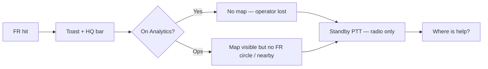

# MOB DISC — FR alert must reach Operations map (not trap until Ack)

**Status:** DISC 2026-07-11 — **`mob-fr-hit-go-ops` APPLIED** · next: `mob-fr-hit-map-sos-parity`  
**Trigger:** FR hit → cannot use map / search / nearby help until Ack — toast + standby PTT feel useless  
**Search:** FR alert map, operational tab, go ops, nearby, standby PTT, ack trap, dead loop  
**Related:** `MOB-DISC-FR-ALERT-UX-SOP-INDUSTRY-SOS-PARITY.md`, `MOB-DISC-FR-6TILE-OFFTILE-ALERT-SOP.md`, `MOB-DISC-FR-STANDBY-PTT-GROUP.md`

---

## Plain answer — you are right

| You said | Truth |
|----------|--------|
| FR alert blocks work until Ack | **Wrong UX** — Ack must **not** be a gate to use map, search, or PTT |
| Need Operational page to see who can help | **Yes** — map + nearby units is core dispatch, not optional |
| Auto-switch to Ops tab? | **Good idea — with rules** (see below) |
| Toast + group PTT useless without map | **Today: mostly yes** — API works but **map incident state** does not |

**Verdict:** The last move (toast shell without **go-ops + map parity**) is **incomplete**. Toast and standby PTT are **not useless as concepts** — they are **unfinished** until Ops map shows the hit pin, circle, and nearby line (same family as SOS).

---

## What breaks today (code-checked)

| Layer | Today | Operator pain |
|-------|--------|----------------|
| **Ack gate** | HQ bar stays until Ack — feels like “alarm mode” | Operator thinks they must Ack before doing anything |
| **Tab** | Hit while on **Analytics** → stays on Analytics | Map is on **Operations** — extra clicks, no auto context |
| **Map on hit** | `showFrSnapOnMap` exists but only from drawer **Map** button | Not called on hit; no 500 m circle; no nearby summary |
| **Standby PTT** | Pushes radio group; toast says “map or wall” | Map has **no FR incident overlay** — PTT team invisible on map |
| **GPS missing** | Map actions disabled | Operator stuck with toast only |
| **Blocking modal** | Backdrop **not** auto-opened on hit (fixed path) | Drawer still easy to open; **real trap is missing map workflow** |



---

## Your proposal — auto Operational tab

### Locked rule (recommended)

> **On FR blacklist hit:** if the operator is **not already on an operational surface**, **switch to Operations** and **focus the map on the catching BWC** (when GPS exists).

**Operational surfaces** (do **not** steal focus):

| Surface | Examples |
|---------|----------|
| **Ops** | Main map + wall |
| **Command wall** | Grid monitoring |
| **Conference / VC** | Live session (optional site flag) |
| **Popout ops** | Map or wall in second window |

**Non-operational** ( **do** auto-go-ops on hit):

| Surface | Examples |
|---------|----------|
| Analytics | Face watch, Verify, Blacklist |
| Settings / Server | Config |
| Evidence / Audit | Back-office |
| Centre Summary | Reporting |

### Why auto-switch is good (enterprise)

| Pattern | VMS / SOC norm |
|---------|----------------|
| Alarm → monitoring view | Genetec / Milestone open **Monitoring** or **Maps** task on critical alarm |
| Context preserved | Alert bar + toast stay; **shell usable** |
| Operator muscle memory | “Red hit → I’m on the map” |

### Why **not** force Ack first

| SOS (correct) | FR must match |
|---------------|---------------|
| Banner + map circle while incident open | FR bar + map focus while hit open |
| PTT team usable **before** ack report | Standby PTT usable **before** FR ack |
| Ack = **closed incident admin** | Ack = **cleared alert UI** — not permission to work |

**Rejected:** “Ack unlocks the app.”

---

## Locked operator SOP (FR = SOS family)

```
1. Hit       → Chime + red toast + HQ bar (any page)
2. Navigate  → Auto Ops IF not on operational surface (above table)
3. Map       → Pan/zoom catching BWC pin + 500 m circle + nearby units line (SOS geometry)
4. Investigate → Optional drawer / FR watch tile — never blocks tab bar or map pan
5. Standby PTT → Push team; map shows team + “hold PTT on pin” (not toast-only lie)
6. Search    → Ops map search / geocode still works during alert
7. Ack       → Clear bar/toast; optional sighting note later — map state may linger 30s fade
```

**Words (locked):** **Go to map** on toast = same as step 2–3. **Open detail** = drawer only.

---

## Toast + standby PTT — when they are **not** useless

| Feature | Needs |
|---------|--------|
| Red toast | Non-blocking glance — who / BWC / % |
| HQ bar | Persistent on every page until Ack |
| Standby PTT | **Map circle + team strip** (SOS parity) |
| Group PTT | Nearby units from GPS — **visible on map** after push |

Without step 2–3, toast/PTT are **half a product**. With them, they complete the SOP.

---

## MOB plan (apply in order — one at a time)

| # | MOB | Delivers | Risk |
|---|-----|----------|------|
| **1** | **`mob-fr-alert-shell-nonblocking`** | Confirm: no backdrop on hit; tab bar always clickable; Ack **not** required for nav; toast **Go to map** wired | 1 |
| **2** | **`mob-fr-hit-go-ops`** | On hit: if non-operational tab → `EvidenceManager.showTab('ops')`; respect popout/VC flag | 2 | **APPLIED 2026-07-11** — **freeze bug** → `MOB-DISC-FR-OPS-FREEZE-SUSPECT-GRADE-SOP.md` |
| **3** | **`mob-fr-hit-map-sos-parity`** | Pan pin, 500 m circle, `sos-response-summary`-style nearby line; reuse `showFrSnapOnMap` + SOS map helpers | 2 |
| **4** | **`mob-fr-standby-ptt-map-strip`** | After standby push: map highlight + sidebar like `#sos-ptt-team-sidebar` | 2 |
| **5** | **`mob-fr-red-toast-go-map`** | Toast action **Go to map** (not disabled); calls #2+#3 | 1 |
| **6** | Later | `mob-fr-ack-incident-record`, sighting report | 2 |

**Note:** `mob-fr-red-toast-shell` (Act 1) stays — Act 3 wires **Go to map** + real hits. This DISC is the **missing bridge**.

**Do not bundle** #1–#4 in one APPLY.

---

## Site flags (optional, ship later)

| Flag | Default | Meaning |
|------|---------|---------|
| `FM_FR_AUTO_GO_OPS` | `1` | Auto-switch to Ops on hit when on Analytics etc. |
| `FM_FR_AUTO_GO_OPS_VC` | `0` | Do not steal focus from Conference |
| `FM_FR_MAP_CIRCLE_M` | `500` | Same as SOS standby radius |

---

## PASS checkpoint (genre)

| # | Test |
|---|------|
| 1 | Start FR watch on **Analytics** → lab/real hit → lands on **Ops** + map panned |
| 2 | Already on **Ops** → hit → **no tab flash**; map updates |
| 3 | Hit → **Standby PTT** without Ack → circle + nearby visible |
| 4 | Hit → type location in map search → works |
| 5 | Ack → bar clears; map usable; PTT team state still shown if radio up |

---

## FAQ

**Q: Should we add a dedicated “Operational” tab for FR only?**  
A: **No.** Use existing **Operations** — one map truth. FR is an **incident overlay** on Ops, like SOS.

**Q: What if operator wants to stay on Analytics wall?**  
A: Toast **minimize** + HQ **Open** keeps FR watch visible; **Go to map** is explicit. Auto-go-ops only when surface is non-operational (configurable off).

**Q: Is the toast MOB wrong?**  
A: **Incomplete, not wrong.** Shell first was Act 1; **go-ops + map** is the mandatory Act 3 integration you identified.

---

## APPLY cheatsheet (when ready)

```text
MOB-APPLY mob-fr-alert-shell-nonblocking
MOB-APPLY mob-fr-hit-go-ops
MOB-APPLY mob-fr-hit-map-sos-parity
MOB-APPLY mob-fr-standby-ptt-map-strip
MOB-APPLY mob-fr-red-toast-go-map
```

---

## Bottom line

| Question | Answer |
|----------|--------|
| Blocked until Ack? | **Bug / wrong design** — fix in MOB #1 |
| Auto Operational tab? | **Yes** when not already on ops surfaces |
| Toast + PTT useless? | **Without map — yes.** With go-ops + SOS map parity — **no** |
| Next APPLY | **`mob-fr-hit-go-ops`** after nonblocking confirm |

Your instinct matches locked direction in `MOB-DISC-FR-ALERT-UX-SOP-INDUSTRY-SOS-PARITY.md` — this DISC names the **Ops tab + map** piece explicitly so we do not ship another toast-only layer.
