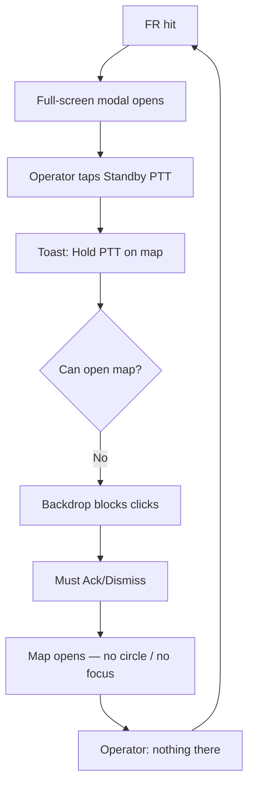

# MOB DISC — FR alert UX dead loop · industry SOP · SOS parity (locked direction)

**Status:** DISC only — **stop stacking band-aids** on current FR modal path  
**Date:** 2026-07-10  
**Trigger:** Operator FAIL — tiny half-face rail · PTT says “map” but modal blocks map · Ack → empty map · no SOP  
**Search:** FR UX, dead loop, snapshot rail, standby PTT, SOS parity, Genetec alarm, SAFR overlay  
**Related:** `MOB-DISC-FR-ALERT-UX-SOS-VS-FR-REPORT.md`, `MOB-DISC-FR-STANDBY-PTT-GROUP.md`, `MOB-DISC-FR-ACK-REPORT.md`

---

## Verdict — you are right

| What you said | Code reality |
|---------------|--------------|
| Snapshots too small / half-face | **Yes** — rail CSS forces **72px × full width + `object-fit: cover`** → chops portraits. Sidecar strict gates help but **UI still mangles** the crop. |
| PTT tells you map, can’t click map | **Yes** — `#fr-alarm-backdrop` is **full-screen z-index 26000** on every hit. Shell blocked. |
| Ack/Dismiss → map has nothing | **Yes** — standby PTT **pushes radio** but **no map circle, no pin focus, no FR incident state** (unlike SOS). |
| Dead loop, no SOP | **Yes** — we shipped **pieces** (bar, modal, beep, standby API) **without** an operator story end-to-end. |

**Stop:** more copy on toast (“go to map”) without map wiring. **Start:** one locked SOP copied from **SOS banner + map**, not a second modal religion.

---

## Dead loop (today)



SOS does **not** do this — banner is **in-flow**, map gets **circle + nearby line + PTT team state**.

---

## What enterprise FR / VMS actually do

Patterns from Genetec Security Center, SAFR+VMS, BriefCam, Intellicene, Valerus (public docs — not OEM names in product):

| Pattern | Behaviour |
|---------|-----------|
| **Alarm task, not modal trap** | Dedicated alarm pane; **shell stays usable** (Maps, Monitoring, Live). |
| **Investigate vs Ack** | *Investigate* = seen, stays active. *Ack* = cleared. *Alternate ack* = false alarm. |
| **Linked video** | Alarm opens **that camera’s live/playback** — not a tiny face strip only. |
| **Scene + face** | Face match thumb **plus** wider scene / live tile (context). |
| **Map** | Alarm tied to **camera location**; map pans/highlights source. |
| **Procedure** | Optional SOP HTML / dispatch steps — not mixed into unrelated forms. |
| **Radio / dispatch** | Separate integration (CAD, radio group, “closest responder”) — **not** “go to map” with no map state. |

**Ubitron fit:** We **already have** SOS banner + map circle + PTT team + ack report. FR should **reuse that shell**, not invent a parallel fullscreen stack.

---

## Locked product SOP (FR = SOS family, different incident type)

```
1. Hit          → HQ bar (all pages) + chime — NO forced fullscreen
2. Investigate  → Optional: Open detail card / jump Live on catching BWC
3. Map          → Pan + pulse catching pin + optional 500m circle (same geometry as SOS)
4. Field cue    → Alert field (beep) — one BWC only
5. Radio        → Standby PTT team — same push as SOS; team shown ON BAR + map summary
6. Ack          → Close interrupt; optional sighting note later (NOT SOS form)
7. History      → Snap ledger + future FR incident index
```

**Words (locked):** Alert field = beep. Standby PTT = radio group. Never interchange.

---

## Gap table — SOS vs FR today

| SOS (works) | FR (broken) |
|-------------|-------------|
| `#sos-banner` in page flow | Full-screen `#fr-alarm-backdrop` |
| Map response circle | **None** |
| `sos-response-summary` nearby line | **None** |
| `activeSosPttTeam` + sidebar after ack | `activeFrStandbyPttTeam` **client only** — no map |
| Pin PTT while banner up | Modal blocks map |
| Ack → SOS report | Ack → **nothing** (audit only) |

---

## Snapshot rail — separate from alert SOP (but operator-visible)

**Two bugs:**

1. **Display:** `height: 72px; object-fit: cover` — fix = taller cards + `object-fit: contain` (or lightbox on click).  
2. **Content:** Operator wants **context** (background helps ID) — sidecar mode **`scene`** = wider crop (face + shoulders + some scene), not chin-only portrait. Keep strict reject for true half-face at edge.

**Not:** another “full-face-only” tweak alone — **UI + crop mode** together.

---

## MOB sequence (one at a time — no bundle)

| Priority | MOB | Fixes |
|----------|-----|-------|
| **1** | `mob-fr-hq-alert-nonblocking` | Bar primary; **no auto fullscreen**; detail card optional; `pointer-events: none` on backdrop OR drop backdrop on hit |
| **2** | `mob-fr-hit-map-sos-parity` | On hit: focus catching pin, 500m circle, summary line; standby PTT updates map like SOS; **Go to map** pans (works because shell not blocked) |
| **3** | `mob-fr-snap-rail-scene-display` | Rail 140–180px, contain, click=enlarge; sidecar `scene` crop option |
| **4** | `mob-fr-standby-ptt-sidebar` | Post-push strip like `#sos-ptt-team-sidebar` — team names, hold PTT hint **on bar** not lying about map |
| **5** | `mob-fr-ack-incident-record` | Ack writes durable hit row |
| **6** | `mob-fr-sighting-report` | Optional note after ack |

**Park / revert messaging:** Change standby toast from “map or wall” until **#2** ships.

**Do not:** merge FR into SOS ack. **Do not:** auto-open modal on hit. **Do not:** commit genre until **#1 + #2** soak PASS.

---

## Rejected (kills us)

| Idea | Why |
|------|-----|
| “Press Ack then find map yourself” | No map state = dead loop |
| Toast-only PTT instructions | Fraud UX |
| Smaller/full-face sidecar only | Ignores 72px `cover` butcher |
| Full-screen modal as primary | Fights every page (your trap) |
| New standby API without map | Already have API — need **shell** |

---

## Mini test after MOB #1 + #2 (short)

1. FR hit → **bar only**, map/nav still clickable  
2. Standby PTT → circle + pin pulse on map  
3. Hold PTT on **that pin** without Ack first  
4. Ack → bar clears; team state still visible if radio up  

PASS/FAIL only.

---

## Bottom line

Industry: **alarm shell + linked video + map + investigate/ack + optional dispatch**.  
Ubitron: **copy SOS shell for FR** — same map/PTT discipline, separate incident/report door.  
Your screenshot FAIL is **expected** on today’s build; next MOBs fix **logic**, not more toast text.
