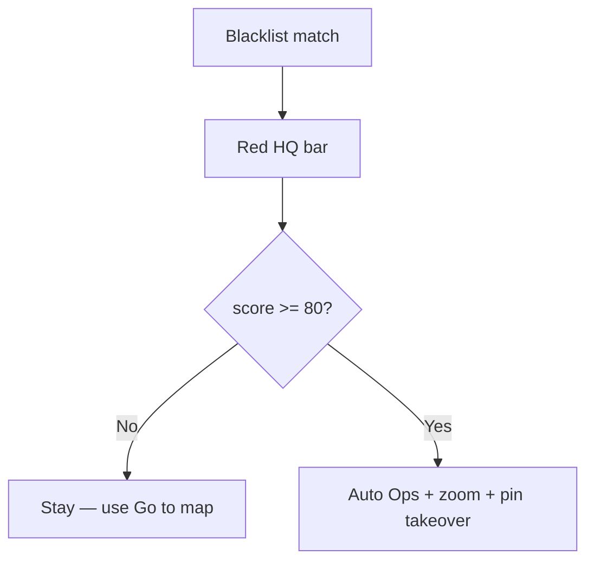

# MOB DISC — Blacklist red banner up but did **not** auto go to map — should it?

**Date:** 2026-07-23  
**Status:** APPLIED 2026-07-23 — see `MOB-APPLIED-FR-BLACKLIST-AUTO-DISPATCH-V1-20260723.md`  
**Operator lock:** auto dispatch at **75%+** (not “always ignore score”).  
**Prior APPLIED:** `FR-BLACKLIST-MAP-PIN-TAKEOVER-V1` (runs **only after** auto/explicit go-ops)

---

## Short answer

| Question | Answer |
|----------|--------|
| **Should Blacklist go automatic?** | **Yes** — product lock: Blacklist = real alert → Ops + map + live pin. Soft grades stay put. |
| **Why didn’t it this time?** | Most likely the **score gate**: auto go-ops only if score ≥ **`FM_FR_MAP_AUTO_SCORE_MIN` (default 80)**. Red bar can show at match threshold (**~75%**). Lab hits often land **75–79%** → **banner yes, jump no**. |
| **Is takeover broken?** | **Not proven** — takeover only runs **after** the tab switch / go-ops path. If auto go-ops never fired, takeover never started. |

Also check: Watchlist grade must be **Blacklist** (not Suspect). Suspect = violet, **no** auto jump (by design).

---

## What “automatic” means (locked)

```
Blacklist hit (interrupt)
  → red HQ bar (+ chime)
  → auto switch to Operations
  → zoom map pin
  → promote wall/pin live (takeover MOB)
```

**Manual always works:** HQ **Go to map** (explicit) → same path, **ignores** score gate.

---

## Why banner without jump (code)

| Gate | Red bar | Auto Ops + map + takeover |
|------|---------|---------------------------|
| Grade Blacklist (`high`) | Yes | Only if other gates pass |
| Grade Suspect / POI / Monitoring | Soft colours; no auto | No |
| Score ≥ **80** (default) | Not required for bar | **Required** for auto |
| Score 75–79 | Bar can show | **Auto blocked** ← common lab case |
| `FM_FR_AUTO_GO_OPS=0` | Bar | Auto blocked |
| Already on Ops / wall / VC | Bar | No tab switch; should still pan/promote if auto map true |

Earlier lab shots (~**77%**, **~80%**) sit right on this knife-edge.



---

## Recommendation (single next APPLY)

**`MOB-APPLY FR-BLACKLIST-AUTO-DISPATCH-V1`**

| Rule | After APPLY |
|------|-------------|
| **Blacklist** | Auto go-ops + map + pin takeover **always** on interrupt (no 80% gate) |
| **Suspect / soft** | Still **no** auto jump |
| Score gate 80 | Keep only if we ever re-enable auto for other grades (not used today) |
| Explicit **Go to map** | Unchanged |

**Why:** Banner without jump feels broken; Blacklist is already the “real alert” grade. Weak % still matched the watchlist — operator should land on the map. False-alarm control = watchlist grade + enroll quality, not a second silent score wall after the bar already fired.

**Do not** turn soft grades back to auto jump.

---

## Operator check now (no APPLY)

1. Read HQ bar: does it say **FR hit** (blacklist) or **FR suspect**?  
2. Read score on the bar — if **&lt; 80**, auto was blocked by design today.  
3. Click **Go to map** once — if zoom + live appear, takeover code is OK; only auto gate was the gap.

---

## Related

| Doc | Role |
|-----|------|
| `MOB-APPLIED-FR-BLACKLIST-MAP-PIN-TAKEOVER-V1-20260723.md` | Takeover after go-ops |
| `MOB-DISC-FR-GRADE-COLOUR-TOAST-MAP-TAKEOVER-ZONE-PTT-20260723.md` | Blacklist should auto |
| `.env.me8.example` | `FM_FR_MAP_AUTO_SCORE_MIN=80` comment |

**Phrase when ready:** `MOB-APPLY FR-BLACKLIST-AUTO-DISPATCH-V1`
