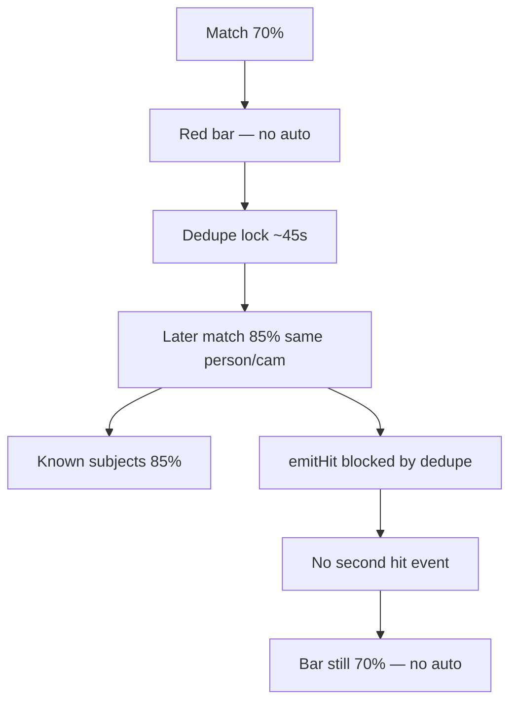

# MOB DISC — First hit 70% (no auto map) → later 85% should auto-dispatch

**Date:** 2026-07-23  
**Status:** APPLIED 2026-07-23 — see `MOB-APPLIED-FR-BLACKLIST-SCORE-UPGRADE-DISPATCH-V1-20260723.md`  
**Operator:** Banner stuck at **70.2%** (no auto map — correct). Known subjects later shows **85%**. Auto map still did **not** run.  
**Logic ask:** First below 75% → no auto; when face gets closer and score rises to **75%+**, then auto — **right?**

---

## Short answers

| Question | Answer |
|----------|--------|
| Is your logic right? | **Yes.** Below 75% → red bar OK, **no** auto Ops/map. When the **same** Blacklist face later scores **≥ 75%**, system **should** then auto-dispatch (Ops + zoom + pin takeover). |
| Why didn’t 85% do it? | **Hit dedupe.** First interrupt for `cam + watchlist id` locks for **`FM_FR_HIT_DEDUPE_MS` (~45s)**. Later stronger match updates **Known/Recent** (`fr-crop-tick`) but **does not** emit a second `fr-blacklist-hit`, so client never re-runs go-ops with the new score. |
| Is auto-dispatch @75 broken? | Only for the **upgrade** case. Fresh first hit at ≥75% should still auto (after Ctrl+F5 / APPLY). |

---

## What we will **not** do

- Auto-jump on every small score tick (spam)  
- Soft grades auto-jump  
- Remove dedupe entirely (would flood Ack/chime)  

---

## How we solve it (recommended single APPLY)

**`MOB-APPLY FR-BLACKLIST-SCORE-UPGRADE-DISPATCH-V1`**

**Rule (locked):**

1. First Blacklist interrupt with score **&lt; 75** → bar only (today).  
2. While dedupe window is active, if a **new** match for the **same** `camId + blacklistId` has score **≥ 75** (and previous emitted score was **&lt; 75**), **re-emit** hit (upgrade) → client `showHit` → **auto go-ops + pin takeover**.  
3. If already emitted at ≥75, keep normal dedupe (no re-spam).  
4. Optional: refresh HQ bar % on upgrade so it shows **85%** not stuck **70%**.

**Touch (planned):**

| Layer | Change |
|-------|--------|
| `lib/frLivePoller.js` `emitHit` | Track `lastHitScore` per key; allow one **cross-threshold** re-emit |
| `public/js/fr-alarm.js` | Treat upgrade hit like new hit for go-ops (already via `showHit`); mark `_dispatched` so we don’t double-jump if already on Ops from manual Go to map |

**Risk:** Low–med. One extra interrupt when walking closer — intended.  

**Not this MOB:** changing 75 floor; changing soft-grade colours.

---

## Operator verify (after APPLY)

1. Ctrl+F5. Blacklist enroll.  
2. Start far / partial face → hit **&lt; 75%** → red bar, **stay** on Analytics.  
3. Walk closer → Known shows **≥ 75%** within ~45s.  
4. **PASS:** auto Ops + map zoom + catching live (bar % updates).  
5. Second PASS: first hit already **80%** → auto once; no storm of re-jumps while standing still.

---

## Related

| Doc | Role |
|-----|------|
| `MOB-APPLIED-FR-BLACKLIST-AUTO-DISPATCH-V1-20260723.md` | Gate = 75% on **first** emit |
| `MOB-APPLIED-FR-BLACKLIST-MAP-PIN-TAKEOVER-V1-20260723.md` | Runs after go-ops |

**Phrase when ready:** `MOB-APPLY FR-BLACKLIST-SCORE-UPGRADE-DISPATCH-V1`
