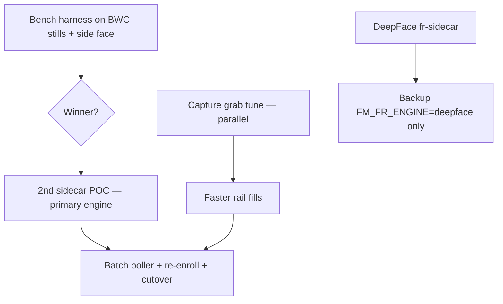

# MOB DISC — BWC walking FR · capture first · bench then 2nd sidecar

**Status:** DISC 2026-07-11 — **no APPLY**  
**Trigger:** Operator thesis — *if capture keeps rolling fast, a fast engine will match; BWC walks, side face matters; Western stacks are slow; Chinese OSS surveillance FR is the model*  
**Search:** bench first, second sidecar, capture speed, walking BWC, side face, SCRFD, SeetaFace6, DeepFace backup  
**Related:** `MOB-DISC-FR-ENGINE-PRIMARY-BACKUP.md`, `MOB-DISC-FR-ENGINE-SEETAFACE6-FACEXZOO.md`, `MOB-DISC-FR-ENGINE-SLOW-LOW-MATCH.md`

---

## Your thesis (locked — we agree)

> **Human-eye fast FR on a body-worn camera is mostly a capture + detect problem, not a slider problem.**

A fixed CCTV camera can afford 1 fps and a heavy embed. A **walking officer** does not:

| Fixed cam mindset (slow regions) | BWC reality (what we must ship) |
|----------------------------------|----------------------------------|
| One good frame per few seconds | **Many attempts per second** while the face is in scene |
| Frontal mugshot match | **Side / partial / motion** — still embeddable with the right detector |
| Batch overnight | **Live rail + alarm** while the unit moves |
| Academic DeepFace demo | **SCRFD-class detect + ArcFace/MobileFaceNet embed** — load-once, ONNX/TenniS |

**If the rail keeps filling with sharp, well-boxed faces, a proper primary engine will pass every test.**  
Today we fail before match: **grab is slow**, **detector is weak**, **embed is slow**, **match runs once per window**.

DeepFace stays **backup only** — not the front path.

---

## What is slow today (code truth)

```
Per cam per poll tick (~2s):
  ffmpeg cold WS attach  →  wait up to FM_FR_GRAB_MS (3500ms)  →  1 JPEG
  × 3 grabs (350ms gap)  →  3× POST /represent-probe
  → DeepFace + opencv + TensorFlow per call
  → matchProbe once on sharpest only
```

| Layer | Today | BWC target |
|-------|-------|------------|
| **Grab** | New ffmpeg+WS per still, 3.5s cap | **&lt;200ms** from already-live pool stream |
| **Detect** | `opencv` via DeepFace | **SCRFD / Seeta** — side face, small face |
| **Embed** | Facenet TF per request | **&lt;50ms** CPU class (MobileFaceNet / `buffalo_sc` class) |
| **Match** | 1× per 3-grab window | **Every good snap** or **2-of-3 temporal** |
| **Cadence** | ~2s poll, serial cams | **≥1 probe/s per live tile** on 4 tiles |

**Snapshots starting = pipeline proof.** **Speed + side-face = next genre.**

---

## Bench first or 2nd sidecar first?

### Answer: **bench harness first**, then **2nd sidecar** — capture MOBs **in parallel** with bench

| Order | MOB | Why this order |
|-------|-----|----------------|
| **1** | `mob-fr-engine-bench-harness` | **1–2 days**, no rip-out — picks **which** Chinese OSS stack wins on **your** walking BWC stills + enroll photos + **side-face** frames. Avoids building the wrong 2nd sidecar. |
| **1b** (parallel) | `mob-fr-capture-grab-tune` | Independent of engine — cuts `GRAB_MS`, fixes grab timeout path. **Immediate** snap cadence win on DeepFace path while bench runs. |
| **2** | `mob-fr-sidecar-primary-poc` | **2nd sidecar** (`fr-sidecar-fast/` or `FM_FR_ENGINE=onnx|seeta`) — only after bench names winner |
| **3** | `mob-fr-poller-batch-grab` | 3 paths → one batch HTTP call |
| **4** | `mob-fr-rail-per-tile-score` + `mob-fr-score-normalize` + `mob-fr-temporal-hit` | Honest % on rail; 2-of-3 alarm |
| **5** | `mob-fr-gallery-re-enroll-migrate` | New embedding dim |
| **6** | `mob-fr-engine-cutover` | Primary default; DeepFace = backup |

**Do not start the full 2nd sidecar before bench** — you risk a week on Seeta Windows DLL pain when ONNX ArcFace-class wins on your clips (or the reverse).

**Do start capture tune in parallel** — your instinct is right: walking BWC needs grab cadence **now**, not after engine swap.



---

## 2nd sidecar — what it is (not a rip-out)

| Piece | Stays | New |
|-------|-------|-----|
| `fr-sidecar/app.py` (DeepFace) | **Yes — backup** | untouched until cutover |
| `lib/frSidecarClient.js` | Same REST contract | `FM_FR_ENGINE` routes to primary or backup |
| Node `frLivePoller` | Same sockets / rail | batch + faster grab |
| REST | `/health`, `/represent-probe`, `/represent`, `/verify` | + `/represent-probe-batch`, timing fields |

**Folder options (pick at APPLY):**

- `fr-sidecar-fast/` — clean parallel tree (preferred for rollback)
- or `FM_FR_ENGINE` switch inside one app (messier)

Primary sidecar rules (from surveillance FR practice):

1. **Models load once** at process start  
2. **SCRFD-class detector** — side / partial face (not opencv)  
3. **ArcFace-class or MobileFaceNet** embed — L2-normalized  
4. **Batch API** — N JPEG paths per request  
5. **Timing JSON** — `detectMs`, `embedMs`, `totalMs` on every response  

DeepFace path: only when `FM_FR_ENGINE=deepface` or primary health fails + fallback flag.

---

## Chinese OSS surveillance FR pattern (what big vendors actually do)

Representative **open** stacks (not product endorsement — bench on your hardware):

| Layer | Typical in fast surveillance FR | ME8 today |
|-------|----------------------------------|-----------|
| Detect | **SCRFD**, RetinaFace-class | opencv |
| Align | 5-point landmark before embed | inconsistent |
| Embed | **ArcFace**, MobileFaceNet | Facenet via DeepFace |
| Runtime | **ONNX Runtime**, TenniS (C++) | TensorFlow per call |
| Search | cosine on **L2-normalized** vectors | raw cosine, uncalibrated % |
| Motion | **High frame rate probe**, temporal N-of-M confirm | 1 match / window |
| Side face | Detector trained for surveillance scenes | often **skip** / miss |

**FaceX-Zoo (Apache 2.0):** training / eval toolbox — export to ONNX, not hot-path torch.  
**SeetaFace6 (BSD class):** best CPU latency narrative — Windows native cost.  
**InsightFace ecosystem:** fastest **lab bench** on Windows — `buffalo_sc` class for POC; ship model pack after counsel.

**Western academic stacks (DeepFace, slow OpenCV DNN demos)** — fine for papers; **not** walking BWC surveillance SOP.

---

## Bench harness — what it must include

**MOB:** `mob-fr-engine-bench-harness` — **APPLIED 2026-07-13** (`scripts/fr-bench/run_fr_engine_bench.py`, `bench/fr/README.md`)  
**Input folder (you provide):**

```
bench/fr/
  enroll/          ← watchlist mugshots (3–10 identities)
  bwc-front/       ← walking BWC, roughly frontal
  bwc-side/        ← walking BWC, ≥30° yaw (mandatory)
  bwc-motion/      ← blur / stride motion (mandatory)
```

**Engines in one run:**

| Engine | Role in bench |
|--------|----------------|
| DeepFace Facenet + opencv | **Baseline (backup path)** |
| DeepFace + retinaface | Upper bound on *same* embed, better detect |
| ONNX ArcFace-class (`buffalo_sc`) | Primary candidate A |
| SeetaFace6 Mobile (if DLL ready) | Primary candidate B |

**CSV output per image:**

- `detectMs`, `embedMs`, `totalMs`  
- `faceDetected`, `faceWidth`, `yawProxy` (if available)  
- same-person vs enroll score (labeled pairs)  
- impostor score p95  

**Pass bar to green-light 2nd sidecar:**

- **≥2× faster** than DeepFace baseline on batch-6  
- **Side-face folder:** detect rate **≥80%** (tune per bench)  
- Same-person p50 **stable** (low variance across motion frames)  

---

## Capture genre (parallel — walking BWC)

These MOBs do **not** wait for 2nd sidecar:

| MOB | Fix |
|-----|-----|
| `mob-fr-capture-grab-tune` | `FM_FR_GRAB_MS` 800–1200; shorter post-EOF wait; fail-fast on dead stream |
| `mob-fr-capture-pool-tap` | Reuse live tile decode / pool buffer — **no new ffmpeg spawn per grab** (bigger MOB — after grab tune) |
| `mob-fr-probe-side-face-gate` | Soften clip gate for side boxes; reject only true half-out-of-frame |
| `mob-fr-poller-parallel-cams` | Probe 4 live cams concurrently (respect 8-live SOP) |

**Operator-visible win:** rail fills **faster** and **more often** while officer walks — even before new engine.

---

## Match genre (after capture + primary embed exist)

| MOB | Fix |
|-----|-----|
| `mob-fr-rail-per-tile-score` | Score every rail snap — show % |
| `mob-fr-score-normalize` | L2 at enroll + probe |
| `mob-fr-temporal-hit` | Alarm on 2-of-3 windows above τ |

---

## What we do NOT do

- ❌ Full 2nd sidecar before bench picks engine  
- ❌ Delete DeepFace before cutover  
- ❌ Another crop-only MOB as substitute for detect/embed  
- ❌ Engine + capture pool tap + UX roster in one push  
- ❌ Touch PTT / SOS / `video-wall.js`  

---

## APPLY commands (when you say — not now)

```text
MOB-APPLY mob-fr-engine-bench-harness     ← START HERE (gates 2nd sidecar)
MOB-APPLY mob-fr-capture-grab-tune        ← parallel OK — walking BWC snap speed
MOB-APPLY mob-fr-sidecar-primary-poc      ← 2nd sidecar — AFTER bench winner
MOB-APPLY mob-fr-poller-batch-grab
MOB-APPLY mob-fr-rail-per-tile-score
MOB-APPLY mob-fr-engine-cutover
```

---

## Bottom line

| Question | Answer |
|----------|--------|
| Bench or 2nd sidecar first? | **Bench first** (small, no rip-out). **2nd sidecar second** with bench winner. |
| Is capture as important as engine? | **Yes** — walking BWC needs **fast snap + side-face detect**; start **grab tune in parallel**. |
| Will fast capture + fast engine pass tests? | **Yes** — that's the surveillance FR pattern; DeepFace backup only. |
| Chinese OSS direction? | **SCRFD detect + ArcFace/MobileFaceNet embed + ONNX/TenniS** — bench Seeta vs ONNX on **your** clips. |

Say **`MOB-APPLY mob-fr-engine-bench-harness`** to start the bench script, and optionally **`MOB-APPLY mob-fr-capture-grab-tune`** in the same week for immediate rail cadence.
