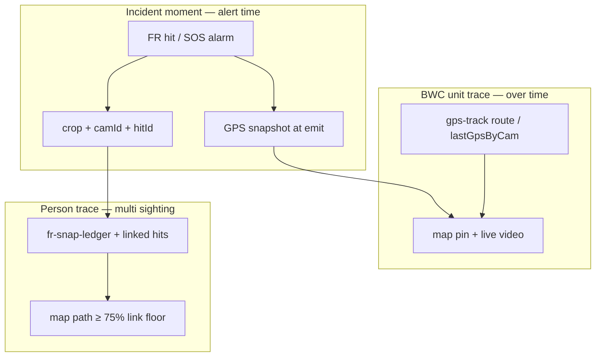

# MOB DISC — FR hit GPS · BWC trace · SOS/alert accountability

**Status:** **APPLIED** 2026-07-11 (`mob-fr-hit-gps-on-emit`)  
**Trigger:** Operator — attach GPS to hit payload should link to **tracing the catching BWC**; same plan as SOS/alert track for reply, operational fault review, and lawful officer support  
**Search:** GPS hit, BWC trace, person track, snap ledger, incident accountability, SOS parity, legal review  
**Related:** `MOB-DISC-FR-MAP-BUTTON-GO-OPS-PIN.md`, `MOB-DISC-FR-HALF-FACE-SNAP-LEDGER.md`, `MOB-DISC-FR-LIVE-POLL.md`, `MOB-DISC-FR-ACK-REPORT.md`, `MOB-DISC-SOS-LEDGER-GOVERNANCE.md`, `MOB-DISC-BWC-ROUTE-TRACE-FR-SOS-UNIFIED.md`

---

## Verdict — yes, same purpose

**Attaching GPS to the FR hit payload is not only for the Map button.** It is the **moment stamp** that ties:

| What | To what |
|------|---------|
| **Who** was matched | Watchlist identity + score |
| **Which BWC** caught them | `camId` + device label |
| **Where** that unit was | `lat` / `lon` / `gpsAt` at hit time |
| **When** dispatch must respond | `at` + audit + ledger |

That is the same family as **SOS alarm GPS** and the existing **BWC route trace** — one **incident accountability** story:

> When control room replies, they can see **where the officer/unit was**, **what the system showed**, and **what dispatch did** — to fix operational faults (no GPS, wrong match, radio gap) and support officers **lawfully** (after-action record, not guesswork).

---

## Three trace layers (locked model)



| Layer | Question it answers | ME8 today |
|-------|---------------------|-----------|
| **1 — Moment** | Where was this BWC when the alert fired? | SOS: **yes** (`buildOpenSosDashboardPayload` + `lastGpsByCam`). FR hit socket: **no** (`emitHit` omits GPS). Ledger crops: **yes** (`resolveGps` at write). |
| **2 — Unit** | Where did this officer go before/after? | **Yes** — `lastGpsByCam`, `/api/gps-track/route`, Evidence route trace, Ops map pin. |
| **3 — Person** | Same face on multiple BWCs — path on map? | **Planned** — `MOB-DISC-FR-LIVE-POLL.md` person track; ledger has points; **no UI** yet. |

**`mob-fr-hit-gps-on-emit` fixes layer 1 for FR** — aligns real-time hit with what the ledger already stores.

---

## Why hit GPS was missing (gap)

| Path | GPS attached? |
|------|----------------|
| `fr-crop-tick` (rail) | **Yes** — `cropTickPayload()` → `gpsFieldsForCam(camId)` |
| `fr-snap-ledger` append | **Yes** — `resolveGps(camId)` at persist |
| `fr-blacklist-hit` (alert) | **No** — `emitHit()` builds hit without `gpsFieldsForCam` |

So dispatch gets a **red toast with no coordinates** while disk already has GPS on the crop row — **split brain**. Map button disabled; auto Ops pan does nothing visible.

**One-line fix (MOB #1):**

```javascript
// emitHit — after building hit object:
Object.assign(hit, gpsFieldsForCam(camId));
```

Also extend `auditLog.record('analytics.fr_blacklist_hit', …)` detail with `lat`, `lon`, `gpsAt` when present.

---

## Locked purpose — operational + lawful use

### Operational (control room)

| Scenario | Trace helps |
|----------|-------------|
| Officer calls “where am I needed?” | Map pin + zoom from hit GPS |
| Match looks wrong | Compare field snap vs watchlist + **which BWC** + location vs known area |
| BWC had no GPS at hit | Flag **operational fault** — unit offline GPS, tunnel, policy gap |
| Standby PTT / field alert sent | Audit + map moment — did we alert the **right** unit? |
| Multi-unit FR hits same person | Person track (layer 3) — who saw them along the path |

### Lawful support (after incident)

| Need | Source |
|------|--------|
| **What did the system show and when?** | Hit payload + snap ledger crop + `hitId` |
| **Where was the BWC?** | Hit GPS + gps-track route for time window |
| **What did dispatch do?** | Audit: `fr-alarm-ack`, `fr-field-alert`, `fr.ptt_standby_team` (separate from SOS audit) |
| **SOS vs FR separation** | Different socket events, audit actions, ledger — **no merged SOS row for FR** |
| **Export / governance** | SOS ledger governance DISC pattern → FR incident index later (`MOB-DISC-FR-ACK-REPORT.md`) |

**Not in scope:** automated legal advice, facial recognition as sole evidence, or covert tracking narrative. Product copy: **dispatch aid + audit trail** under site policy and role scope.

---

## Unified incident story (SOS + FR + alerts)

Same **operator grammar**, different incident type:

| Step | SOS | FR watchlist hit |
|------|-----|------------------|
| Signal | `sos-alarm` + GPS | `fr-blacklist-hit` + GPS (**after MOB**) |
| Map | Pan + circle + nearby | Pan + pin + circle (**parity MOB**) |
| Live | Pin popup / wall | Same pin — catching BWC |
| Radio | PTT team | Standby PTT team (FR audit) |
| Field | (device SOS) | Alert field (beep) |
| History | SOS ledger + folder | FR snap ledger + **future FR incident index** |
| Unit trace | Route for that `camId` | Route for catching + any linked BWCs |

**FR does not replace SOS ledger.** It **reuses map, GPS, audit, and route** infrastructure.

---

## Data contract — hit payload (after MOB #1)

```javascript
{
  hitId, camId, deviceLabel, blacklistId, displayName,
  scorePct, cropUrl, photoUrl, at, listStatus, reasonCode,
  lat, lon, gpsAt,           // NEW — from lastGpsByCam at emit
  gpsSource: 'last_gps',    // optional — honest provenance
  ledgerSnapId               // optional later — link to fr-snap-ledger row
}
```

| Field rule |
|------------|
| `lat`/`lon` null → UI shows “No GPS”; map uses **last known pin** if any (`MOB-DISC-FR-MAP-BUTTON-GO-OPS-PIN.md`) |
| Never fabricate coordinates |
| `gpsAt` may be stale vs `at` — show both in meta when skew > N seconds (later polish) |

---

## MOB plan (genre: trace & accountability)

| # | MOB | Layer | Delivers |
|---|-----|-------|----------|
| **1** | **`mob-fr-hit-gps-on-emit`** | Moment | GPS on socket hit + audit detail |
| **2** | **`mob-fr-map-focus-pin`** | Moment → map | Ops + pin + popup (dispatch now) |
| **3** | **`mob-fr-hit-incident-link`** | Moment → disk | `hitId` on ledger row; `GET /api/analytics/fr/hits/:hitId` |
| **4** | **`mob-fr-snap-ledger-ui`** | Person / review | List snaps + matches + **Show on map** + filter by BWC |
| **5** | **`mob-fr-person-track-map`** | Person | Multi-hit path ≥ 75% (`MOB-DISC-FR-LIVE-POLL.md`) |
| **6** | **`mob-fr-ack-sighting-note`** | Lawful | Optional operator note on Ack (not SOS form) |
| **7** | **`mob-incident-timeline-export`** | Lawful | Time window: FR hits + SOS + audit + route GPX (role-gated) |

**Order for dispatch pain:** **1 → 2** first. **3–4** for after-action. **5–7** genre commits.

One MOB at a time · PASS between each.

---

## PASS checkpoint — `mob-fr-hit-gps-on-emit`

1. BWC reporting GPS on map (`lastGpsByCam` populated).
2. Trigger real watchlist hit (not lab preview).
3. Socket payload / drawer meta shows lat/lon (not “No GPS”).
4. `storage/fr-snap-ledger/index.jsonl` last match row — same coords within reason.
5. Audit row `analytics.fr_blacklist_hit` includes `lat`, `lon` in detail.
6. Lab preview unchanged — still no fake GPS.

---

## Apply command

```
MOB-APPLY mob-fr-hit-gps-on-emit
```

Then map focus:

```
MOB-APPLY mob-fr-map-focus-pin
```

---

## FAQ

| Question | Answer |
|----------|--------|
| Is this “tracking officers”? | **Unit position** for dispatch and **documented incidents** — same as SOS + gps-track today; role-scoped. |
| Person track vs BWC trace? | **BWC trace** = one unit over time. **Person track** = same face across units (FR ≥ 75% link). |
| Ledger already has GPS — why hit too? | Real-time alert path must match disk; Map/toast/HQ bar read **hit**, not ledger API. |
| Help officers legally? | After-action: where they were, what C2 showed, what dispatch sent — audit + crops + route, export under policy. |
| Operational faults? | “No GPS at hit” visible → fix device, policy, or coverage — not silent failure. |

---

## Roadmap cross-links

| Doc | Link |
|-----|------|
| `MOB-DISC-FR-MAP-BUTTON-GO-OPS-PIN.md` | Map button — consumes hit GPS |
| `MOB-DISC-FR-HALF-FACE-SNAP-LEDGER.md` | Ledger = forensic memory |
| `MOB-DISC-FR-LIVE-POLL.md` | Person track ≥ 75% |
| `MOB-DISC-FR-ACK-REPORT.md` | Ack vs sighting report |
| `MOB-DISC-SOS-LEDGER-GOVERNANCE.md` | SOS export/clear governance pattern |
