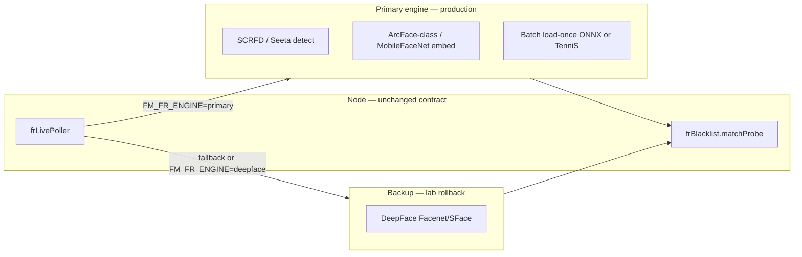

# MOB DISC — FR engine: primary fast stack · DeepFace backup only

**Status:** DISC 2026-07-11 — **`mob-fr-engine-bench-harness` APPLIED 2026-07-13** (script only; run when images ready). Next: `mob-fr-sidecar-primary-poc` after CSV PASS.  
**Trigger:** Face watch **snapshots now start** (runtime PASS) but **slow**; **matching worse** than capture  
**Search:** DeepFace backup, primary engine, SeetaFace6, InsightFace, slow match, engine bench  
**Related:** `MOB-DISC-FR-ENGINE-SLOW-LOW-MATCH.md`, `MOB-DISC-FR-ENGINE-SEETAFACE6-FACEXZOO.md`, `MOB-DISC-RUNTIME-FR-CHILD-PROCESS.md`

---

## Where we are (honest)

| Layer | Status | Verdict |
|-------|--------|---------|
| **Runtime** | FR sidecar can start; snapshots fill rail | **PASS** (lab) |
| **Capture** | Rolling rail, quality gates, GPS metadata | Works — proves pipeline |
| **Speed** | Seconds per cam per tick | **FAIL** for operations |
| **Match** | Same person, many snaps, few/no hits | **FAIL** — worse than capture |
| **Engine** | **DeepFace + TensorFlow + opencv** on every probe | **Lab POC only** |

Your call is correct: **DeepFace must not be the front engine.** It stays as **rollback / verify fallback** until a fast primary is proven on your BWC stills.

---

## Why snapshots work but matching feels broken

Two different jobs are coupled today:

```
Live BWC → grab JPEG (slow) → DeepFace detect+embed (slow) → Node matchProbe (once/window)
                ↓                        ↓
         rail snap (every good grab)   alarm (best frame only)
```

| Symptom | Cause (code truth) |
|---------|-------------------|
| Many similar rail tiles | Rolling rail emits **every** good grab (`ROLLING_RAIL=1`) |
| Almost no matches | **One** `matchProbe` per 3-grab window on sharpest frame only |
| Rail shows 0% | Per-tile match **not run** — scores only on window winner |
| Slow | `FM_FR_GRAB_MS=3500` + serial 3× `/represent-probe` + TF cold path |
| Weak match | `opencv` detector + Facenet embed + enroll mugshot vs MPEG wall frame |
| Score feels random | Cosine × 100 — **not** calibrated to “ID software %”; verify API uses different scale |

**Capture is ahead of matching.** Fixing crops alone will not fix match rate.

---

## Locked architecture — primary + backup



| Role | Engine | When used |
|------|--------|-----------|
| **Primary** | Bench winner: **SeetaFace6 Mobile** *or* **ONNX ArcFace-class** (see bench) | Default after cutover; all live watch + enroll |
| **Backup** | **DeepFace** (`fr-sidecar/app.py` today) | `FM_FR_ENGINE=deepface` or primary health fail + `FM_FR_FALLBACK_DEEPFACE=1` |
| **R&D only** | FaceX-Zoo PyTorch | Train/export — **not** in request hot path |

**Rule:** No big-bang delete of DeepFace. Parallel sidecar or `FM_FR_ENGINE` flag until bench PASS + re-enroll.

---

## Primary engine candidates (bench, not guess)

| Candidate | Speed (CPU class) | Windows lab | Commercial | Notes |
|-----------|-------------------|-------------|------------|-------|
| **SeetaFace6 MobileFaceNet** | ~9ms/embed (vendor i7 table) | Native build / DLL | BSD + README commercial | Best fit for edge server; model redistribution plan needed |
| **ONNX ArcFace-class** (`buffalo_sc` class) | ~50–150ms CPU | **Easiest** pip/ONNX | MIT/BSD parts — counsel at ship | Fastest path to **working bench** on your PC |
| **DeepFace Facenet** (today) | seconds | Easy | Facenet OK | **Backup only** |
| **FaceX-Zoo** | slow in torch loop | Medium | Apache 2.0 | Toolbox — export to ONNX after train |

**Ship note:** InsightFace `buffalo_l` is **bench/lab**; customer pack uses counsel-approved primary + documented model files.

---

## What to do next — ordered roadmap

**Three genres — never stack in one MOB:**

### Genre 1 — Engine (your priority)

| Step | MOB | Outcome |
|------|-----|---------|
| **1** | `mob-fr-engine-bench-harness` | Script: 20 BWC stills + enroll mugshots → CSV timings + scores for **primary candidates vs DeepFace** |
| **2** | `mob-fr-sidecar-primary-poc` | New implementation behind `FM_FR_ENGINE=onnx` (or `seeta`); **load-once**, **`/represent-probe-batch`**, timing JSON |
| **3** | `mob-fr-poller-batch-grab` | Node: 3 grabs → **one** HTTP batch call per cam tick |
| **4** | `mob-fr-gallery-re-enroll-migrate` | Re-embed watchlist (dim change); DeepFace gallery kept for rollback |
| **5** | `mob-fr-engine-cutover` | Default primary; DeepFace = `FM_FR_ENGINE=deepface` only |

**Gate:** Step 2 blocked until Step 1 shows **≥2× faster embed** and **same-person recall ↑** on your labeled set.

### Genre 2 — Match logic (parallel quick wins — no engine swap)

These fix **“many snaps / no match”** on screen even before engine swap:

| MOB | Fix |
|-----|-----|
| `mob-fr-rail-per-tile-score` | Score **each** rail grab; show % on tile |
| `mob-fr-score-normalize` | L2-normalize at enroll + probe; one threshold scale |
| `mob-fr-temporal-hit` | Alarm on **2-of-3** windows above τ — not one lucky frame |

**Recommend:** Apply Genre 2 **after** Genre 1 Step 1 bench, **before** cutover — so operators see honest scores during A/B.

### Genre 3 — UX (separate from engine)

| MOB | Fix |
|-----|-----|
| `mob-fr-watch-roster-table` | Enterprise watch picker (32 BWC / groups) — see `MOB-DISC-FR-WATCH-ROSTER-ENTERPRISE.md` |

**Do not** mix Genre 3 with Genre 1 in one push.

---

## DeepFace as backup — concrete rules

| Setting | Production | Lab / rollback |
|---------|------------|----------------|
| `FM_FR_ENGINE` | `onnx` or `seeta` (winner) | `deepface` |
| `FM_FR_FALLBACK_DEEPFACE` | `1` — if primary OOM/crash, log + optional fallback | `0` during primary bench |
| `FM_FR_MODEL` | N/A (primary model pack) | `Facenet` / `SFace` only — **never VGG** |
| `FM_FR_DETECTOR` | Primary detector (SCRFD / Seeta) | `opencv` (backup path only) |
| Watchlist embeddings | Primary dim only in active index | DeepFace 128-dim archive JSON for restore |

**Health API** returns `{ engine: "onnx", fallback: "deepface", ready: true }` so Verify tab shows which path is live.

---

## Bench protocol (Step 1 — do this before any engine MOB)

| # | Action |
|---|--------|
| 1 | Pick 3 enrolled identities + 20 BWC stills each (front + slight side) |
| 2 | Run harness: primary POC vs DeepFace — same files |
| 3 | Record: `detectMs`, `embedMs`, `totalMs`, same-person p50/p95, impostor p95 |
| 4 | Pass bar: **≥2× faster** than DeepFace on batch-6 images; same-person p50 **≥** current threshold with **lower variance** |
| 5 | Legal one-pager for winner model redistribution |

**APPLIED:** script at `scripts/fr-bench/run_fr_engine_bench.py` — drop images in `bench/fr/` then run `scripts\fr-bench\RUN-FR-ENGINE-BENCH.bat`.

---

## What we explicitly do NOT do next

- ❌ Tune threshold slider hoping match fixes itself  
- ❌ More crop/scene MOBs as substitute for engine  
- ❌ Delete `fr-sidecar/app.py` before bench PASS  
- ❌ Touch PTT, SOS, live wall, `video-wall.js`  
- ❌ Engine + watch roster UX in one commit  

---

## Decision tree (one line)

```
Snapshots work?  YES → bench primary engine → POC sidecar → batch poller → re-enroll → cutover
                 DeepFace stays backup via FM_FR_ENGINE=deepface
Match UX honest?  rail-per-tile-score + normalize (after bench, before cutover)
Picker scale?     mob-fr-watch-roster-table (separate genre)
```

---

## APPLY commands (when you choose — not now)

```text
MOB-APPLY mob-fr-engine-bench-harness          ← start here
MOB-APPLY mob-fr-sidecar-primary-poc           ← after bench numbers
MOB-APPLY mob-fr-poller-batch-grab
MOB-APPLY mob-fr-rail-per-tile-score           ← match honesty on screen
MOB-APPLY mob-fr-gallery-re-enroll-migrate
MOB-APPLY mob-fr-engine-cutover
```

---

## Bottom line

**Snapshots prove the pipeline.** **DeepFace on the hot path proves we needed a lab shortcut — not a product engine.**  
Next genre is **bench → primary sidecar → batch poller → re-enroll**, with DeepFace demoted to **backup/rollback only**. Matching gets honest only after **faster embed + per-tile score + normalized cosine** — not another crop tweak.
