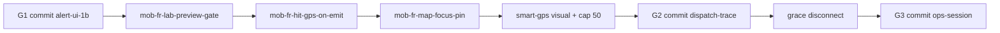

# MOB DISC — Genre queue · what next · commit consolidation (2026-07-11)

**Status:** DISC locked — **master queue** after Act 1b alert UI PASS  
**Search:** what next, priority, low risk, genre commit, lab-git-push  
**Related:** `MOB-DISC-FR-GENRE-ROADMAP-UI-ENGINE-ALERT.md`, `MOB-DISC-FR-GENRE-COMMIT-PUSH-BASELINE.md`

---

## Where we are

**Act 1b alert UI — operator PASS on:**

- `mob-fr-go-ops-freeze-fix`
- `mob-fr-alert-drawer-info-first`
- `mob-fr-alert-drawer-expand`

**Also applied this genre wave (earlier 2026-07-11):** go-ops, red toast, drawer shell, tile/roster polish, fleet health degraded, etc. — see roadmap table.

**Tons of DISCs written — not applied.** This doc **orders** them.

---

## Rule (unchanged)

1. **One MOB-APPLY** at a time → PASS/FAIL  
2. **Batch git commit** per **genre** when you say `lab-git-push-<genre>`  
3. **Low risk first** unless incident blocks dispatch  
4. **No engine** until dispatch trace + ship polish genres stable  

---

## Genre map for commits

| Genre ID | Name | Ready to commit? | When |
|----------|------|------------------|------|
| **G1** | **`lab-fr-alert-ui-1b`** | **YES — now** | After mini checkpoint below |
| **G2** | **`lab-fr-dispatch-trace`** | After G2 MOBs PASS | GPS + Map + smart GPS visual |
| **G3** | **`lab-ops-session`** | After G3 MOBs PASS | Grace + restore (medium) |
| **G4** | **`lab-fr-ship-polish`** | After G4 MOBs PASS | Lab hide, tiered alerts, HQ rename |
| **G5** | **`lab-smart-gps-cap`** | Can merge into G2 or单独 | Manual cap 50 |
| **G6** | **`lab-fr-engine`** | **Later** | Bench → port — do not rush |

**Do not** one mega-commit of everything. **G1 first**, then apply G2 MOBs, commit G2, etc.

---

## G1 — Commit now: `lab-fr-alert-ui-1b`

### Files (typical — `git status` is truth)

`public/js/fr-alarm.js`, `public/index.html`, `public/locales/en.json`, `public/js/fr-live-watch.js`, `public/js/settings-hub.js`, `lib/platformHealth.js`, `server.js` (health only if in genre), `docs/MOB-DISC-FR-*.md` (this wave)

### Mini checkpoint before push

```
RESTART-FLEET.bat → hard refresh
→ FR hit or lab toast → Ops clickable (freeze fix)
→ Drawer info-first + ⤢ expand PASS
→ VC · PTT · SOS · one live · stop — no regression
```

### Commit message (example)

```
lab-fr-alert-ui-1b: go-ops freeze, drawer info-first, expand, toast shells
```

### You say

```
MOB-APPLY lab-git-push-fr-alert-ui-1b
```

(or `lab-git-push-fr` if you prefer one FR bucket — **this slice only**)

---

## What next — priority queue (suggested)

### Tier 0 — Ship hygiene (lowest risk · do first after G1 commit)

| # | MOB | Risk | Why first |
|---|-----|------|-----------|
| 1 | **`mob-fr-lab-preview-gate`** | **Very low** | Hide “Preview (lab)” — professional ship; `FM_FR_LAB_UI=1` only |
| 2 | **`mob-fr-hit-gps-on-emit`** | **Low** | One server fix — unlocks Map + trace; `frLivePoller.js` only |

### Tier 1 — Dispatch trace (low–medium · genre G2)

| # | MOB | Risk | Depends |
|---|-----|------|---------|
| 3 | **`mob-fr-map-focus-pin`** | **Medium** | #2 — Map / Go to map actually works |
| 4 | **`mob-smart-gps-fleet-visual-v2`** | **Low** | GPS track ON visible — counter, labels |
| 5 | **`mob-smart-gps-manual-cap`** | **Low** | Default **50** manual cap + warn @32 |
| 6 | **`mob-fr-hit-smart-gps`** | **Low–med** | Auto high-res on FR hit (`fr-hit` reason) |

**G2 commit** after #2–6 PASS: `lab-git-push-fr-dispatch-trace`

### Tier 2 — Operator pain (medium · genre G3)

| # | MOB | Risk | Note |
|---|-----|------|------|
| 7 | **`mob-live-viewer-grace-disconnect`** | **Medium** | F5 doesn’t kill streams — checkpoint VC/PTT/SOS |
| 8 | **`mob-operator-session-restore`** | **Medium** | Pins/video back after refresh |
| 9 | **`mob-live-stream-exit-banner`** | **Low** | Dismissible strip — not modal |

**Skip** `mob-refresh-guard-live` unless you opt in (`FM_REFRESH_GUARD=1`).

**G3 commit:** `lab-git-push-ops-session`

### Tier 3 — Alert product (medium · genre G4)

| # | MOB | Risk |
|---|-----|------|
| 10 | **`mob-fr-alert-tier-server`** | Medium — suspect ≠ blacklist |
| 11 | **`mob-fr-amber-toast-suspect`** | Low UI after #10 |
| 12 | **`mob-fr-hit-map-sos-parity`** | Medium — circle + nearby |
| 13 | **`mob-fr-hit-route-deep-link`** | Low — Evidence route from hit |
| 14 | **`mob-smart-gps-map-ring`** | Low — cyan ring on map |

**G4 commit:** `lab-git-push-fr-alert-tier`

### Tier 4 — Engine (park until G2 PASS)

| # | MOB | Risk |
|---|-----|------|
| 15 | **`mob-fr-engine-bench-harness`** | Medium |
| 16+ | sidecar port, re-enroll, probe queue 32 | High |

**Do not** start engine until dispatch Map + GPS trace genre PASS.

---

## One-page “do this week”



---

## Parking lot (DISC only — not next)

| Topic | DISC |
|-------|------|
| Person track map | `MOB-DISC-FR-LIVE-POLL.md` |
| Snap ledger UI | `MOB-DISC-FR-ACK-REPORT.md` |
| Watchlist grade patch | `MOB-DISC-FR-OPS-FREEZE-SUSPECT-GRADE-SOP.md` |
| Refresh browser guard | `MOB-DISC-REFRESH-GUARD-LIVE-WARN.md` — opt-in |
| Fleet fatal bind exit | `MOB-DISC-FLEET-ENTERPRISE-UPTIME.md` |

---

## Risk legend

| Label | Meaning |
|-------|---------|
| **Very low** | Hide UI, i18n, CSS-only |
| **Low** | Server one-liner, fleet strings, cap enforce |
| **Medium** | `fr-alarm.js` + map, grace streams, tier server |
| **High** | Engine, probe queue, live morph |

---

## FAQ

| Question | Answer |
|----------|--------|
| Commit before more MOBs? | **Yes — G1 now** locks alert UI wave |
| First MOB after commit? | **`mob-fr-lab-preview-gate`** or **`mob-fr-hit-gps-on-emit`** — your pick; preview is safest |
| Map still broken? | **#2 then #3** — GPS on hit then focus pin |
| 50 GPS track? | **#5** in G2 — after visual #4 |
| Engine? | **Tier 4** — after G2 |

---

## Your next command (pick one)

```
MOB-APPLY lab-git-push-fr-alert-ui-1b
```

or continue MOBs:

```
MOB-APPLY mob-fr-lab-preview-gate
```

```
MOB-APPLY mob-fr-hit-gps-on-emit
```
