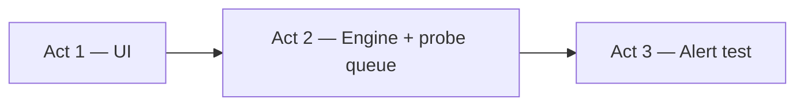

# MOB DISC — FR genre roadmap · UI → engine → alert

**Status:** DISC locked 2026-07-11 — **execution order agreed** · **queue:** `MOB-DISC-FR-GENRE-QUEUE-COMMIT-20260711.md`  
**Order:** **1 UI (low risk)** → **2 FR engine + 32 snap queue** → **3 alert test**  
**Search:** roadmap, apply order, UI first, engine fallback, alert test  
**Locked product:** **32 snap+match · 6 video rotate · rail morph on hit**

---

## Genre map (three acts)



| Act | Risk | Operator sees |
|-----|------|----------------|
| **1 UI** | Low | 6-tile grid, roster done, rail/alert shells |
| **2 Engine** | Medium | Fast snap, 32 queue, DeepFace backup |
| **3 Alert** | Medium | Off-tile hit → rail live + drawer + toast |

**Rule:** One **MOB-APPLY** at a time · **PASS/FAIL** between each · no stacking.

**Stability:** `MOB-DISC-FR-STABILITY-GUARD.md` — **no regression** on VC · PTT · SOS · live wall · map. Agent flags risk **before** APPLY when tier ≥ 2.

**Not mixed with SOS/PTT/live wall:** `MOB-DISC-FR-NOT-MIXED-LIVE-SOS-PTT.md` — plain answer for operators.

---

## Act 1 — UI (low risk) — **START HERE**

Already **APPLIED:** `mob-fr-watch-roster-table` (grouped roster, search, filter).

### MOB sequence

| # | MOB | Files (typical) | PASS checkpoint |
|---|-----|-----------------|-----------------|
| 1.1 | **`mob-fr-6tile-grid-ui`** | `fr-live-watch.js`, `index.html` CSS, `en.json` | **APPLIED 2026-07-11** |
| 1.2 | **`mob-fr-6tile-all-rotate`** | `fr-live-watch.js` | `LIVE_SLOTS=6`, rotate 32 watch, meta `6/6 live` |
| 1.3 | **`mob-fr-rail-alert-shell`** | `fr-alarm.js`, `index.html` CSS | **APPLIED 2026-07-11** — match rail overlay + alert drawer shell |
| 1.4 | **`mob-fr-alert-drawer-shell`** | `fr-alarm.js`, `index.html` | **APPLIED 2026-07-11** — video stub, compare photos, meta grid, Map, lab preview |
| 1.5 | **`mob-fr-red-toast-shell`** | `fr-alarm.js`, CSS | **APPLIED 2026-07-11** — red toast component; lab preview + shell on hits |

**Not in Act 1:** probe queue, engine swap, real off-tile stream, server changes.

**After Act 1 PASS:** Hard refresh → 6 tiles rotate · roster works · drawer/toast **look** right on mock.

### Act 1b — Parked polish (after shells, your feedback 2026-07-11)

| MOB | Topic |
|-----|--------|
| `mob-fr-roster-group-coherent` | **APPLIED 2026-07-11** — one column, expand/collapse, groups stay together |
| `mob-fr-roster-width-compact` | **APPLIED 2026-07-11** — fixed columns, dark scrollbar |
| `mob-fr-roster-group-grid` | **APPLIED 2026-07-11** — 4-col group cards · **video cap WRONG** → see `MOB-DISC-FR-TILE-HUMAN-LAYOUT.md` |
| `mob-fr-tile-human-aspect` | **APPLIED 2026-07-11** — portrait 3:4 tiles, remove 32vh crush · see `MOB-DISC-FR-TILE-HUMAN-LAYOUT.md` |
| `mob-fr-tile-grid-fit-six` | **APPLIED 2026-07-11** — equal 3×2 zone, no aspect-ratio · see `MOB-DISC-FR-TILE-GRID-FIT-SIX.md` |
| `mob-fr-roster-compact-seven-row` | **APPLIED 2026-07-11** — search up, drop repeat 32/6, 7-row unit · see `MOB-DISC-FR-ROSTER-COMPACT-SEVEN-ROW.md` |
| `mob-fr-panel-balance-video-roster` | **APPLIED 2026-07-11** — cap video ~320px · **void bug** → see `MOB-DISC-FR-PANEL-VIDEO-BOX-SPLIT.md` |
| `mob-fr-panel-video-box-split` | **APPLIED 2026-07-11** — video to black-box line, roster fixed below · see `MOB-DISC-FR-PANEL-VIDEO-BOX-SPLIT.md` |
| `mob-ui-no-text-select` | **APPLIED 2026-07-11** — `app-select-guard.css` · see `MOB-DISC-UI-NO-TEXT-SELECT.md` |
| `mob-fr-stop-video-toolbar` | **APPLIED 2026-07-11** — Stop video, Stop all, tile × · see `MOB-DISC-FR-NEXT-UI-BWC-PLACEMENT-STOP.md` |
| `mob-fr-tile-status-hints` | **APPLIED 2026-07-11** — tile states, borders, 15s signal retry · `MOB-DISC-FR-ROSTER-COMPACT-STOP-TILE-WARN.md` |
| `mob-fr-red-toast-shell` | **APPLIED 2026-07-11** — toast shell · **needs** `MOB-DISC-FR-ALERT-GO-OPS-MAP.md` (go-ops + map) |
| `mob-fr-go-ops-freeze-fix` | **APPLIED 2026-07-11** — Ops map + toast clickable after hit |
| `mob-fr-alert-drawer-info-first` | **APPLIED 2026-07-11** — compare/meta above fold; video collapsed footer |
| `mob-fr-alert-drawer-expand` | **APPLIED 2026-07-11** — header ⤢ maximize; session persist |
| `mob-fr-hit-gps-on-emit` | DISC — GPS on hit + BWC trace genre · `MOB-DISC-FR-BWC-GPS-TRACE-INCIDENT-ACCOUNTABILITY.md` |
| `mob-fr-map-focus-pin` | DISC — Map/Go to map → Ops + pin + live popup |
| `mob-fr-hit-smart-gps` | DISC — auto high-res track on FR hit · `MOB-DISC-BWC-ROUTE-TRACE-FR-SOS-UNIFIED.md` |
| `mob-fr-hit-route-deep-link` | DISC — open Evidence Route trace from hit |
| `mob-smart-gps-manual-cap` | DISC — default **50** manual cap · `MOB-DISC-SMART-GPS-MANUAL-CAP-50.md` |
| `mob-smart-gps-fleet-visual-v2` | DISC — GPS track ON visual + counter · `MOB-DISC-SMART-GPS-TRACK-VISUAL-STATE.md` |
| `mob-live-viewer-grace-disconnect` | DISC — refresh/reconnect don’t kill streams · `MOB-DISC-OPERATOR-REFRESH-SESSION-RESTORE.md` |
| `mob-fr-lab-preview-gate` | DISC — hide Preview lab buttons on ship · `MOB-DISC-FR-LAB-PREVIEW-SHIP-HIDE.md` |

**Act 3 alert integration (operator FAIL feedback):** `MOB-DISC-FR-ALERT-GO-OPS-MAP.md` — **`mob-fr-hit-go-ops` APPLIED** · next `mob-fr-hit-map-sos-parity`

DISC: `MOB-DISC-FR-ROSTER-COMPACT-STOP-TILE-WARN.md` · **operator summary:** `MOB-DISC-FR-NEXT-UI-BWC-PLACEMENT-STOP.md` · **4-col grid:** `MOB-DISC-FR-ROSTER-GROUP-GRID.md`

---

## Act 2 — Engine + 32 snap queue (fallback path)

DeepFace **`fr-sidecar/app.py` stays** as `FM_FR_ENGINE=deepface` backup. Primary engine added **parallel**, not rip-out.

### MOB sequence

| # | MOB | Delivers | PASS checkpoint |
|---|-----|----------|-----------------|
| 2.1 | **`mob-fr-engine-bench-harness`** | CSV timings on BWC stills + side-face | Winner: ONNX or Seeta (documented) |
| 2.2 | **`mob-fr-capture-grab-tune`** | Lower `GRAB_MS`, fail-fast | Snaps faster on **current** engine |
| 2.3 | **`mob-fr-watch-set-server-sync`** | Full **32** IDs to server | `fr-watch-set` payload in logs |
| 2.4 | **`mob-fr-probe-queue-32`** | `VIDEO_SLOTS=6`, `PROBE_QUEUE=32`, `PROBE_PARALLEL=6` | All 32 cycle snaps (DeepFace OK for lab) |
| 2.5 | **`mob-fr-headless-probe-grab`** | Off-tile snap without 6th–7th full video | Rail fills for off-grid BWCs |
| 2.6 | **`mob-fr-sidecar-primary-poc`** | 2nd engine behind `FM_FR_ENGINE` | Bench winner; DeepFace fallback flag |
| 2.7 | **`mob-fr-poller-batch-grab`** | Batch represent-probe | Tick time ↓ |
| 2.8 | **`mob-fr-score-normalize`** + **`mob-fr-rail-per-tile-score`** | Honest % on rail | Match visible per snap |
| 2.9 | **`mob-fr-gallery-re-enroll-migrate`** | New embeddings | After engine cutover only |
| 2.10 | **`mob-fr-engine-cutover`** | Default primary; `deepface` = fallback | `FM_FR_ENGINE=deepface` rollback tested |

**After Act 2 PASS:** 32 watch · 6 video · rail snaps from **all** BWCs · engine fast · **RESTORE path** = set `FM_FR_ENGINE=deepface` + restart service.

---

## Act 3 — Alert test (integration)

Requires Act **2.4+** (off-tile snaps can hit) and Act **1.3–1.5** (UI shells).

### MOB sequence

| # | MOB | Delivers | PASS checkpoint |
|---|-----|----------|-----------------|
| 3.1 | **`mob-fr-rail-snap-to-live`** | Match rail cell → mini JSMpeg | Off-tile hit shows **live** in rail |
| 3.2 | **`mob-fr-stream-reuse-policy`** | Reuse if on grid; cap 7 distinct | No cap blow at 7/8 |
| 3.3 | **`mob-fr-alert-drawer-live`** | Wire real video + meta + actions | Toast → drawer full SOP |
| 3.4 | **`mob-fr-red-toast-hit`** | Real hits drive toast | Red toast on every hit |
| 3.5 | **`mob-fr-alarm-modal-retire`** | Drawer primary; modal optional/minimal | Map/roster not blocked |

### Alert test script (operator)

| # | Step | PASS |
|---|------|------|
| 1 | 32 watch · 6 video · wait probe queue | Rail snaps from **off-tile** BWC |
| 2 | Blacklist match off-tile | Red toast + rail **live morph** |
| 3 | Click toast | Drawer: video + crop + watchlist + **Ack/Dismiss/Field/PTT** |
| 4 | Hit on-tile BWC | Reuse stream — **no 7th** ffmpeg |
| 5 | Ack | Drawer closes; rail → thumb; rotate continues |
| 6 | `FM_FR_ENGINE=deepface` fallback | Snaps still work (slower) |

---

## What we are NOT doing in this roadmap

- ❌ Act 2 before Act 1 UI PASS  
- ❌ Alert live morph before probe queue  
- ❌ 8 main tiles (stay **6 video / 32 snap**)  
- ❌ Touch `video-wall.js`, PTT, SOS, locked files  
- ❌ Git push until user confirms genre PASS (`lab-git-push-fr` style separate)

---

## APPLY cheatsheet (copy when ready)

```text
── Act 1 UI ──
MOB-APPLY mob-fr-6tile-grid-ui
MOB-APPLY mob-fr-6tile-all-rotate
MOB-APPLY mob-fr-rail-alert-shell
MOB-APPLY mob-fr-alert-drawer-shell
MOB-APPLY mob-fr-red-toast-shell

── Act 2 Engine ──
MOB-APPLY mob-fr-engine-bench-harness
MOB-APPLY mob-fr-capture-grab-tune
MOB-APPLY mob-fr-watch-set-server-sync
MOB-APPLY mob-fr-probe-queue-32
MOB-APPLY mob-fr-headless-probe-grab
MOB-APPLY mob-fr-sidecar-primary-poc
… (then cutover MOBs as needed)

── Act 3 Alert ──
MOB-APPLY mob-fr-rail-snap-to-live
MOB-APPLY mob-fr-alert-drawer-live
MOB-APPLY mob-fr-red-toast-hit
```

---

## First command

```text
MOB-APPLY mob-fr-6tile-grid-ui
```

(Roster table already applied — next is **6-tile grid**.)

---

## Bottom line

| Act | What |
|-----|------|
| **1** | UI — 6 tiles, rotate, rail/alert **shells** (low risk) |
| **2** | **32 snap queue** + **primary engine** + **DeepFace fallback** |
| **3** | **Alert test** — rail morph, toast, drawer, full SOP |

You are right on **32 snap / 6 video** — Act 2 delivers that; Act 1 paints it; Act 3 proves alerts off-tile.
