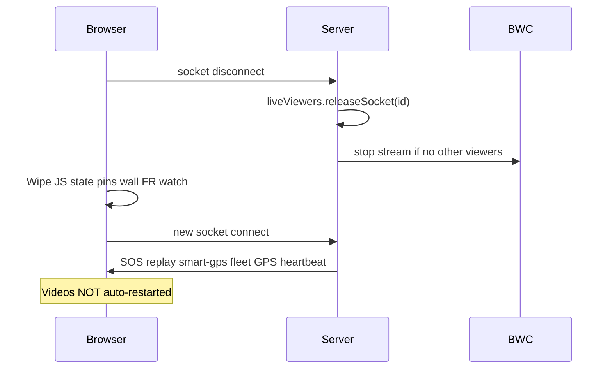

# MOB DISC — Operator refresh · don’t kill live · session restore

**Status:** DISC only — **2026-07-11**  
**Trigger:** Operator — hard refresh during ops kills all online UI, video pins, BWCs cut off; how to prevent; what industry does  
**Search:** refresh, reconnect, liveViewers disconnect, session restore, map pins, F5  
**Related:** `MOB-DISC-ME8-FLEET-SCALE-SOP.md`, `MOB-DISC-FR-STABILITY-GUARD.md`, `MOB-DISC-SMART-GPS-TRACK-VISUAL-STATE.md`

---

## Short answer

| Question | Answer |
|----------|--------|
| Why does refresh cut everything? | Full reload = **new browser tab** → old socket **disconnects** → server **releases your live video refs** → streams stop. Map pins / wall layout live **only in browser memory**. |
| Does server forget GPS track? | **No** — `smartGpsTrack` + SOS stay on server; reconnect sends `smart-gps-state` + SOS replay. |
| Can we prevent? | **Yes** — grace disconnect + session restore + refresh guard (MOBs below). |
| Industry? | **Reconnect without killing streams** (grace period) + **restore layout** + **warn before unload**; thick clients keep server session. |

---

## What happens today (code truth)

### On F5 / hard refresh



| State | Lost on refresh? | Restored on reconnect? |
|-------|------------------|------------------------|
| **Live video** (map pin / wall) | **Yes** — refs released | **No** — manual start again |
| **Map pin checkboxes** (`selectedCamIds`) | **Yes** — client Set | **No** |
| **Command wall layout** | **Yes** | **No** |
| **FR live watch** | **Yes** — `beforeunload` stops watch | **No** |
| **Smart GPS high-res** | **No** — server Map | **Yes** — `smart-gps-state` event |
| **Open SOS banner** | **No** — server open alarms | **Yes** — `sos-alarm` replay |
| **Fleet online list** | Flash empty then refill | **Yes** — `fleet-roster` + heartbeat replay |
| **lastGpsByCam positions** | Map markers may flicker | **Yes** — `gps-update` replay |

**Root cause:** `socket.on('disconnect')` → `liveViewers.releaseSocket` → `releaseCamStreamWhenUnwatched` — **immediate**, no grace for same operator reconnect.

---

## What already helps (don’t break)

| Mechanism | Benefit |
|-----------|---------|
| **Viewer ref-count** | Other dispatchers on same cam **keep** stream if you refresh |
| **SOS replay on connect** | Banner returns (`buildOpenSosDashboardPayload` replay) |
| **smart-gps-state on connect** | Fleet 📍 cyan after refresh **when Fleet panel renders** |
| **replayOnlineDeviceStateToSocket** | Heartbeat + GPS for online fleet |
| **Conference refs** | VC ingress separate from dashboard socket |

---

## Industry patterns (public safety / VMS)

| Pattern | Who / what | Ubitron fit |
|---------|------------|-------------|
| **Server-owned subscriptions** | Stream stays up while **session** valid, not per TCP socket | Move toward **operator session id** with grace |
| **Disconnect grace (30–120s)** | Brief network blip or tab refresh does not stop BWC encode | **`mob-live-viewer-grace-disconnect`** |
| **Client layout restore** | Saved watch lists, map extent, open cameras | **`mob-operator-session-restore`** |
| **beforeunload warning** | “You have N live streams” if F5 | **`mob-refresh-guard-live`** |
| **Auto-reconnect WebSocket** | Socket.IO already reconnects **without** full page reload | Prefer **soft reconnect** over F5 |
| **Separate dispatch workstation** | 24/7 wall PC — no refresh habit | Ops SOP: refresh only on deploy |
| **Thick / native client** | Genetec/Milestone desktop — persistent process | Web C2 — must mimic with server grace |

**Axon Respond-class:** live map + streams are **cloud session**; browser refresh re-fetches state and re-subscribes — streams may restart but **layout** often preserved server-side.

**Honest:** Full **zero-cut** refresh on pure SPA without server MOBs is **not** possible today — we need grace + restore.

---

## Locked product direction

### Tier 1 — Stop accidental suicide (ship first)

| MOB | Behaviour |
|-----|-----------|
| **`mob-refresh-guard-live`** | If operator has ≥1 live view: optional browser confirm on tab close/F5 — **opt-in, after grace** · `MOB-DISC-REFRESH-GUARD-LIVE-WARN.md` |
| **`mob-live-viewer-grace-disconnect`** | On disconnect, start **90s timer** before `releaseCamStreamWhenUnwatched` for that socket’s cams; cancel if same `username` reconnects |

### Tier 2 — Restore after refresh (same operator)

| MOB | Persist (sessionStorage) | On `socket.connect` replay |
|-----|------------------------|----------------------------|
| **`mob-operator-session-restore`** | Pin cam IDs (≤8), surfaces (`ops`/`cw`), active tab | Re-emit `start-video` / reopen pins **staggered** (fleet SOP cap) |
| **`mob-fr-watch-session-restore`** | FR watch on + slot cams (optional) | Re-`emitWatchSlots` if licensed |

**Not persisted:** secrets, full video URLs, SOS ack state (server owns).

### Tier 3 — Enterprise (later)

| MOB | Behaviour |
|-----|-----------|
| **`mob-operator-session-server`** | Server-side `operatorSessions` map — survives refresh, multi-tab merge |
| **`mob-command-wall-profile`** | Named wall layouts (like Genetec layouts) |

---

## Grace disconnect — design sketch

```javascript
// server.js — on disconnect
scheduleViewerRelease(socket.id, username, 90000); // 90s

// on connect — same dashboard username
cancelScheduledRelease(username);
// OR re-attach new socket.id to existing viewer refs (harder — tier 3)
```

**Simpler v1:** grace only — if operator reconnects within 90s, **do not stop** cams that were in `toStop` list for that socket.

**Risk:** Zombie streams if operator closes browser — 90s cap acceptable (industry norm).

---

## Session restore — design sketch

```javascript
// client beforeunload / visibility + periodic
sessionStorage.setItem('fm_ops_restore', JSON.stringify({
  v: 1,
  at: Date.now(),
  pins: [{ camId, surface }],
  tab: 'ops',
  frWatch: false,
}));

// dashboard-boot socket connect (after server-capabilities)
OperatorRestore.replayIfFresh(120000); // 2 min max age
```

**Stagger:** 400ms between `start-video` — same as login replay — respect **8 live max**.

---

## Operator SOP (until MOBs ship)

| Do | Don’t |
|----|-------|
| Use **socket reconnect** (network blip) — wait 10s | **F5 during live incident** |
| `RESTART-FLEET` only on deploy / smoke | Refresh to “fix” FR UI — use Ack/nav |
| Re-open pins from Fleet after refresh | Expect videos to survive refresh today |
| Note: **GPS 📍 track** survives refresh (server) | Confuse with video — video dies on refresh |

---

## MOB plan (priority)

| P | MOB | Risk |
|---|-----|------|
| **P0** | **`mob-live-viewer-grace-disconnect`** | Medium — stream lifecycle |
| **P1** | **`mob-live-stream-exit-banner`** | Low — dismissible strip when live open (preferred to modal) |
| **P2** | **`mob-refresh-guard-live`** | Opt-in `FM_REFRESH_GUARD=1` — see `MOB-DISC-REFRESH-GUARD-LIVE-WARN.md` |
| **P2** | **`mob-operator-session-restore`** | Medium — must respect 8-cap |
| **P3** | **`mob-fr-watch-session-restore`** | Low–medium |

**Do not bundle** with FR MOBs — checkpoint VC · PTT · SOS · wall after grace MOB.

---

## PASS checkpoint — grace + guard

1. Start live on 2 BWCs (map pins).
2. **Hard refresh** within 5s → within 90s streams **still running** (BWC still streaming) OR guard warned before refresh.
3. After refresh + restore MOB: pins **auto-return** within 30s (staggered).
4. Close browser tab entirely → within 90s streams stop (no zombie forever).
5. Second dispatcher on same cam — refresh user A does not kill user B’s view.

---

## Apply commands

```
MOB-APPLY mob-refresh-guard-live
```

then

```
MOB-APPLY mob-live-viewer-grace-disconnect
```

then

```
MOB-APPLY mob-operator-session-restore
```

---

## FAQ

| Question | Answer |
|----------|--------|
| Why not Service Worker? | Overkill; grace + restore solves 90% |
| FR hit toast on refresh? | HQ bar replays if hit still open server-side — partial; FR watch stops |
| Smart GPS after refresh? | Server keeps; Fleet UI updates on `smart-gps-state` — see visual DISC |
| Competition? | Grace + restore + warn; enterprise uses persistent client or server session |
