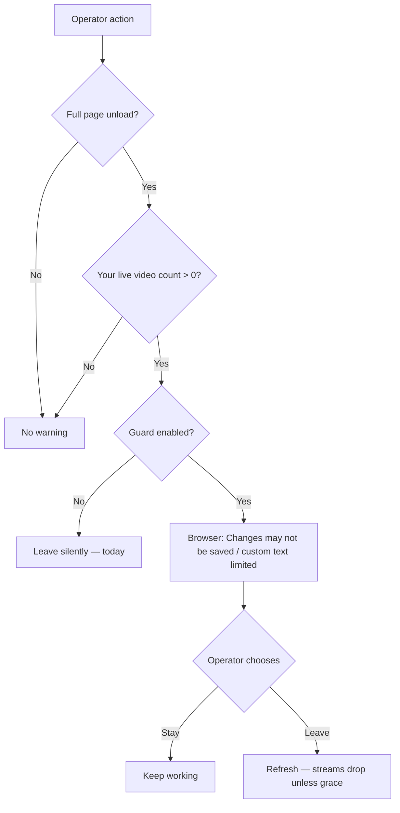

# MOB DISC — Refresh guard · when it warns · not annoying

**Status:** DISC only — **2026-07-11**  
**Trigger:** Operator — “warn if live streams open — why? annoying? when does it warn?”  
**Search:** refresh guard, beforeunload, F5, live streams, leave site  
**Related:** `MOB-DISC-OPERATOR-REFRESH-SESSION-RESTORE.md`

---

## Plain answer

| Question | Answer |
|----------|--------|
| **What is it?** | Browser **“Leave site?”** dialog — only if you try to **close the tab**, **close the window**, or **hard refresh (F5)** while you have **live video** open. |
| **Why?** | Today F5 **cuts BWCs off** immediately — easy mis-click during ops. One chance to cancel. |
| **Annoying?** | **Can be** — if it fires too often. **Not default forever** — see locked policy below. |
| **When does it warn?** | **Only** on page exit with ≥1 **your** live stream. **Never** on normal Ops clicks, map pan, FR toast, tab change inside C2. |

---

## What it is NOT

| Does NOT warn | Why |
|---------------|-----|
| Clicking map, SOS, FR, Settings | Same page — no unload |
| Socket blip / Wi‑Fi 1s drop | Socket.IO **reconnects** — page stays loaded |
| Opening second monitor / alt-tab | Tab hidden ≠ leave |
| GPS 📍 track on | Not live video — no dialog |
| Another dispatcher’s streams | Only **your** viewer refs count |
| After **grace MOB** ships | F5 within 90s may **not** kill streams — guard **off** or softer |

---

## When the browser dialog appears (if enabled)



**Triggers unload (guard may run):**

- **F5** / Ctrl+R / Ctrl+Shift+R  
- Close tab / close browser  
- Type new URL in address bar  
- Click external link that navigates **away** from C2  

**Does not trigger:**

- In-app navigation (Ops ↔ Analytics ↔ Evidence)  
- Opening drawer / modal  
- Soft socket reconnect  

---

## Why we considered it

You reported: **refresh during ops → all pins/video gone → BWCs cut off.**

The guard is a **cheap seatbelt** until better fixes ship:

| Fix | What it does | Annoyance |
|-----|----------------|-----------|
| **Grace disconnect** (primary) | Server waits ~90s before stopping streams on disconnect | **None** — F5 often harmless |
| **Session restore** | Re-open pins after refresh | **None** |
| **Refresh guard** (optional) | Browser confirm before unload | **Some** — only on real exit |

**Order locked:** Build **grace + restore first** · guard is **optional**, not the main solution.

---

## Annoying — how we avoid nagging

### Locked policy — `mob-refresh-guard-live`

| Rule | Setting |
|------|---------|
| **Default** | **`FM_REFRESH_GUARD=0`** (OFF) until grace MOB PASS |
| **Enable after grace** | `FM_REFRESH_GUARD=1` — optional site flag |
| **Threshold** | Warn only if **≥1 live video** (not GPS, not FR watch alone) |
| **SOS incident** | Still warn if live open — SOS is exactly when mis-F5 hurts |
| **Snooze** | Checkbox **“Don’t warn again this shift”** → `sessionStorage` until logout |
| **No custom text spam** | Modern browsers **ignore** custom message — generic “Leave site?” only |
| **Prefer in-app banner** | Non-blocking strip: `3 live streams — refresh stops video` (dismissible) |

### What operators see (if guard ON)

Browser native dialog (wording varies by Chrome/Edge):

> *Leave site? Changes you made may not be saved.*  
> **[Leave]** **[Cancel]**

We **cannot** force long text like “3 BWCs will stop” — browser limits this.

**Better UX than dialog:** persistent **HQ strip** when `liveCount > 0` — no modal.

---

## Recommended MOB order (revised)

| P | MOB | Annoyance |
|---|-----|-----------|
| **P0** | **`mob-live-viewer-grace-disconnect`** | None — fixes root cause |
| **P1** | **`mob-operator-session-restore`** | None — recovery |
| **P2** | **`mob-live-stream-exit-banner`** | Low — dismissible strip, not modal |
| **P3** | **`mob-refresh-guard-live`** | Medium — **opt-in** `FM_REFRESH_GUARD=1` only |

**Park guard** if grace + restore PASS — many sites will **never need** the browser dialog.

---

## Operator SOP (plain)

| Situation | What to do |
|-----------|------------|
| “Something looks stuck” | Try **Ops tab** / wait 10s reconnect — **don’t F5 first** |
| Deploy / new JS | Refresh **after** stopping live, or use grace window |
| Accident F5 during incident | Re-open pins from Fleet — until restore MOB |
| See “Leave site?” | **Cancel** if you still need live video |

---

## PASS checkpoint

**Grace MOB:** F5 with 2 live → within 90s streams still up → **no guard needed**.

**Guard MOB (if enabled):** 2 live → F5 → dialog once → Cancel stays · Leave drops streams · Snooze → no dialog until logout.

---

## FAQ

| Question | Answer |
|----------|--------|
| Warn on every refresh? | **Only** full page unload + live video + guard enabled |
| Annoying during normal work? | **No** — normal clicks don’t unload |
| Why not always on? | Grace + restore are better; dialog is last resort |
| Industry? | Same browser pattern as Gmail/Docs unsaved — we prefer server grace |

---

## Apply (only if you want opt-in guard)

```
MOB-APPLY mob-live-viewer-grace-disconnect
```

Optional later:

```
MOB-APPLY mob-refresh-guard-live
```

with `.env` `FM_REFRESH_GUARD=1`.
