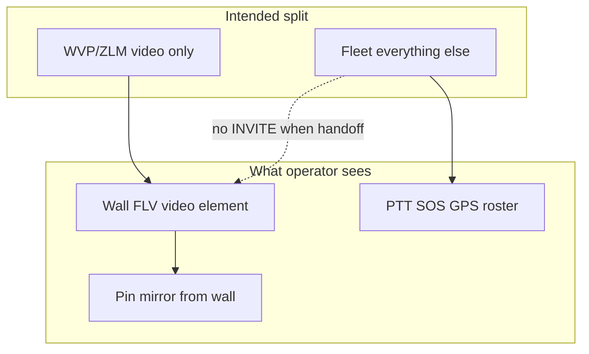

# MOB DISC — Why WVP feels nothing like Fleet (pin video + layout jump)

**Date:** 2026-07-20  
**Status:** DISC only — no code  
**Operator:** *"Should it be just WVP for video? Fleet still remains? But pin no video, layout jumps to top — totally different from Fleet."*

---

## Short answer

**Yes — the plan was WVP for video only; Fleet for PTT, SOS, GPS, roster, pins chrome.**  
**But video handoff changed the wall player technology** (JSMpeg canvas → FLV `<video>`). Pin video is **not a second pipe** — it **mirrors the wall**. When wall uses WVP and pin mirror timing/layout hooks fire differently, it **feels like a different product**, even though most non-video code is still Fleet.

---

## What was supposed to stay Fleet

| Area | Pipe | Handoff on? |
|------|------|-------------|
| PTT / Call | Fleet `:29201` | ✓ unchanged |
| SOS ACL / banner | WVP `:5060` → translator → classic events | ✓ |
| GPS / device status | Fleet SIP MESSAGE / queries | ✓ |
| Map pins chrome, dock layout, 8-pin slim | Classic UI | ✓ |
| Fleet roster / online | Fleet registry (+ WVP warm MOB) | ✓ |
| **Live video encode path** | **WVP `startPlay` → ZLM FLV** | **← only this swapped** |

Backend: `start-video` with `FM_WVP_VIDEO_HANDOFF=1` → **skip Fleet SIP INVITE** → `wvpVideoHandoff.ensurePlay` → `video-stream-ready { wvpVideoHandoff, flvUrl }`.

Everything else still goes through classic `server.js` / `fleet-ui.js` / `index.html` pin shell.

---

## Why pin video fails or looks dead (handoff)

### Classic Fleet pin (Jul-18 PASS)

```
start-video → Fleet INVITE → MPEG-TS → JSMpeg canvas on wall
Pin → mirror wall canvas OR second JSMpeg on same pool WebSocket
```

Two ways pin could get picture: **mirror** or **own JSMpeg**.

### Handoff pin (now)

```
start-video → NO Fleet INVITE → WVP FLV → <video class="me8-zlm-primary"> on wall
Pin → MUST mirror wall (canvas OR <video>) — no Fleet TS for pin JSMpeg
```

Code (`video-wall.js`):

- `wallMirrorSourceForCam` — canvas first, else handoff `<video>` if `wallSlotDecodedForCam`.
- `attachMapPopupPlayer` — if no mirror source yet → **"Live streaming…"** overlay.
- Fallback `attachCanvasPlayer` + `videoWsUrl` **needs Fleet pool** — **dead under handoff**.

So pin picture **only appears after the wall slot has decoded FLV**. Open pin first, or open pin while wall still inviting → black / streaming label. **Not a missing pin MOB in isolation — architectural coupling.**

Partial fix already in tree (`wallMirrorSourceForCam` + video mirror RAF). Still race-sensitive:

1. Pin opens before `onProven` on wall FLV (~300ms–3s).
2. `syncPinVideoFromWall` retries at 80ms / 450ms — may not be enough on slow WVP.
3. `shouldLazyPinLive` — pins ranked **> 8** do not auto-play (by design for 8-on-map); need **Play** on pin bar.

**Half-pass pattern:** wall PASS + pin FAIL = documented since Jul 17 Soft Open (`MOB-DISC-WVP-HALF-PASS-PIN-BLACK-JUL19-LOST-20260720.md`).

---

## Why layout “jumps to the top”

Not one bug — **several classic layout engines re-run on every pin/wall event:**

| Trigger | What it does |
|---------|----------------|
| Map pin click | `assignColocatedPinPopupDocks()` ×3 (0ms, 120ms, 150ms, 450ms) |
| `assignColocatedPinPopupDocks` | Clears `pinPopupDragOffset`, recomputes dock side/ring/index, `repositionAllOpenPinPopupsMeasured()` |
| Handoff wall `onProven` when **≥2** live cams | `ensurePopupsForLiveWallCams()` — **auto-opens pin for every live wall cam** + dock again |
| GPS / `placeCameraMarker` | `map.setView` when `shouldPanMapToDevice` (selected cam or SOS far from center) |
| Fleet row select | `selectFleetDevice` → may `assignCamToSlot` (wall) + pin open |

Under WVP, wall goes live in bursts (Open All, multi-slot). **`ensurePopupsForLiveWallCams` fires more often** than in classic single-invite flow → extra popups + dock resets → pins **snap to computed dock positions** (often upper ring of colocated cluster). Feels like “jumped to top” vs your saved 8-pin fan.

**Jul 19 slim 8-pin layout** (`MOB-APPLY-PIN-POPUP-SLIM-8`) — chrome/CSS still partly in tree.  
**Jul 19 panel rail 348px / 16:9 fit-five** — **lost** on Jul 20 classic restore (`#video-wall` back to **272px**). So layout you remember may literally not be the current CSS floor.

---

## “It behaves totally different from Fleet” — honest matrix

| Behavior | Classic Fleet | Handoff now | Same? |
|----------|---------------|-------------|-------|
| Wall play button | Fleet INVITE, JSMpeg | WVP startPlay, FLV video | **No** (expected) |
| Pin video | Mirror or JSMpeg | Mirror from wall only | **No** (stricter) |
| Pin auto-open on 2+ wall live | Rare / slot-based | `ensurePopupsForLiveWallCams` | **No** (more aggressive) |
| Online on dashboard | SIP :5062 keepalive | WVP register + warm poll | **No** (slower without warm) |
| PTT grouping XML | Fleet MESSAGE | Fleet + WVP-homed relay | **Mostly** |
| PTT audio path | `:29201` | `:29201` | **Yes** (if cam logs in) |
| SOS cold | GB Alarm | ACL translator | **Yes** (shape) |
| 8-pin dock math | Classic | Classic (but more re-dock churn) | **Partly** |

So: **not “Fleet replaced”** — **video surface + presence timing changed**; UI hooks written for Fleet canvas lifecycle **were not fully re-tuned for WVP FLV + multi-auto-pin**.

---

## Architecture diagram



Pin is **downstream of wall** in handoff — not parallel Fleet video.

---

## What would make it feel like Fleet again (disc — APPLY separate)

| # | MOB (named) | Fixes |
|---|-------------|--------|
| 1 | `MOB-APPLY-WVP-HANDOFF-PIN-MIRROR-HARDEN-V1` | Pin: wait for wall `video-slot-has-live`, longer resync, direct FLV on pin only if mirror fails (last resort) |
| 2 | `MOB-APPLY-HANDOFF-SUPPRESS-AUTO-PIN-STORM-V1` | Gate `ensurePopupsForLiveWallCams` — do not auto-open pins on wall prove unless SOS / Open All / user opened pin |
| 3 | `MOB-APPLY-REAPPLY-PANEL-16x9-FIT-FIVE-V1` | Restore Jul 19 wall rail sizing on current tree |
| 4 | `MOB-APPLY-PIN-DOCK-STABLE-ON-WALL-LIVE-V1` | Skip full `assignColocatedPinPopupDocks` reset when only wall decode changed (preserve user-moved + ring) |

**Do not** restore classic snapshot to “get Fleet back” — that **removes** WVP handoff wall picture you finally have.

---

## Operator checks (no code)

1. **Pin after wall live:** Play wall panel first → wait **Live** → then open map pin → picture?  
2. **Pin cold:** Open pin only → streaming forever? (confirms mirror dependency)  
3. **Layout:** One pin open → play second wall cam → do extra pins auto-open and jump?  
4. **8th+ pin:** 9th pin open → video lazy until Play? (expected)

---

## One line

WVP was meant to swap **only** the wall video pipe; pin still mirrors wall, but handoff removed Fleet TS so pin **cannot** self-play — plus multi-wall auto-pin + dock resets make layout fight your 8-pin plan. Fleet PTT/SOS/GPS code is still there; **video player technology and its side-effects** are what feel alien.
